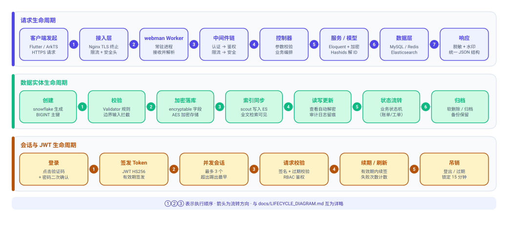
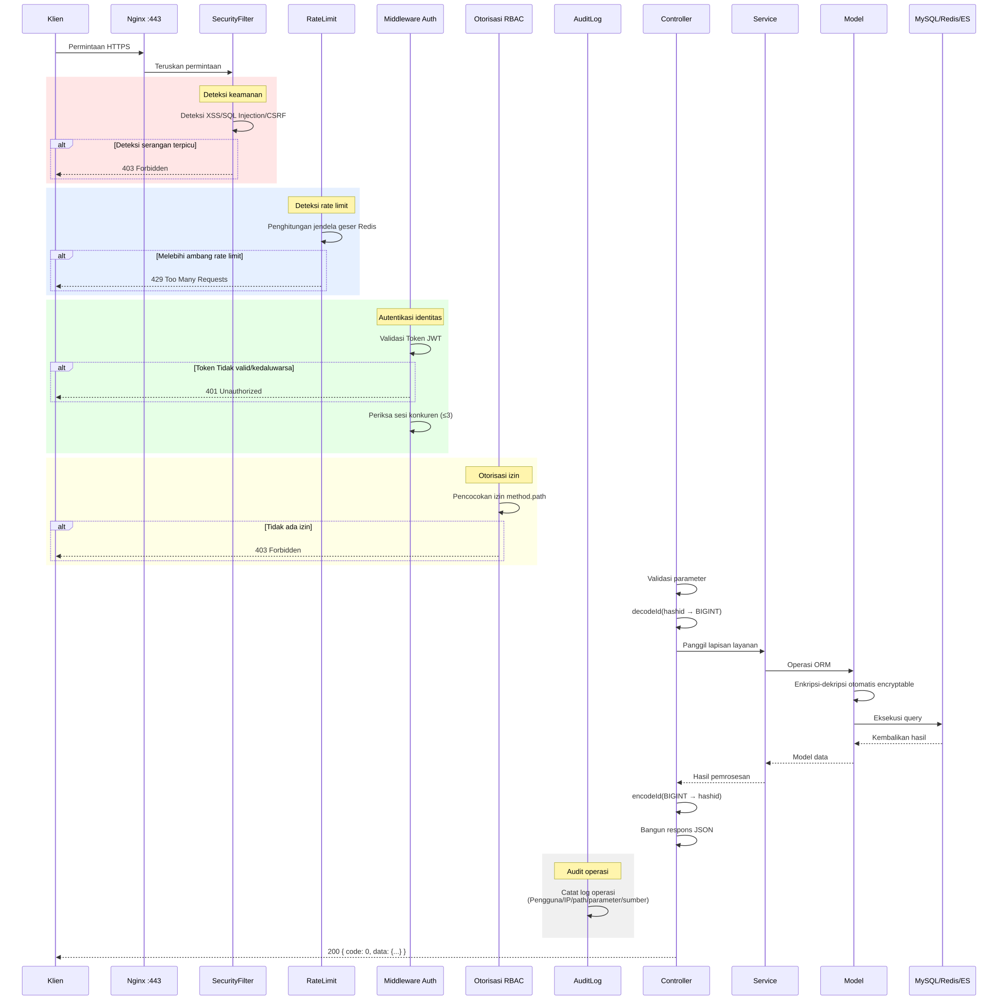
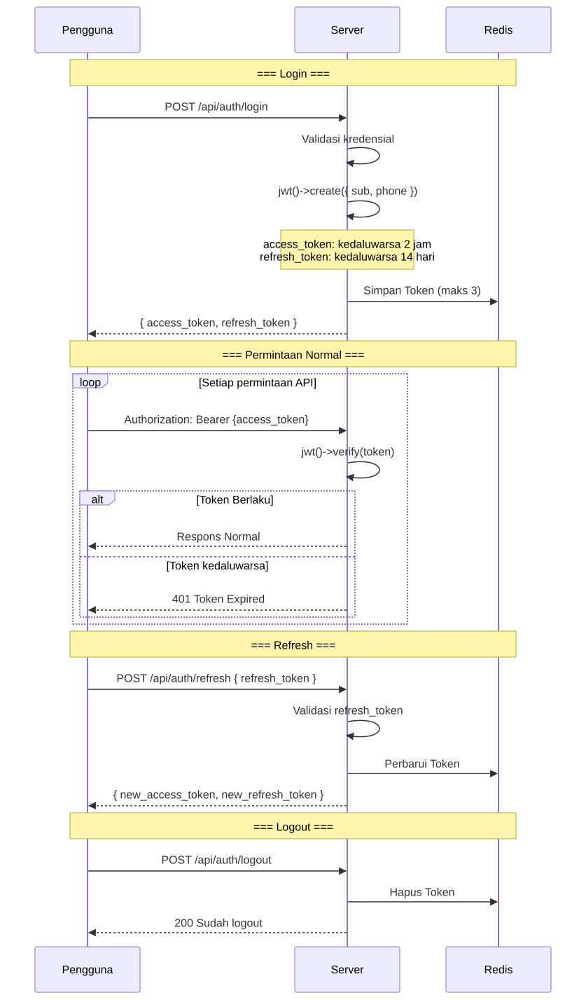

# Diagram Siklus Hidup (Lifecycle Diagram)

> Copyright (c) 2026 erik <erik@erik.xyz> — https://erik.xyz

> English edition: `../../../images/design_lifecycle_en.svg`

---

## 1. Siklus Hidup Request

---

## 2. Siklus Hidup Entitas Data — Pemilik (Owner)

---

## 3. Siklus Hidup Entitas Data — Tagihan Biaya (Fee Bill)

---

## 4. Siklus Hidup Entitas Data — Tiket Perbaikan (Repair Order)

---

## 5. Siklus Hidup Token JWT

---

## 6. Siklus Hidup Lengkap Rekaman Database

