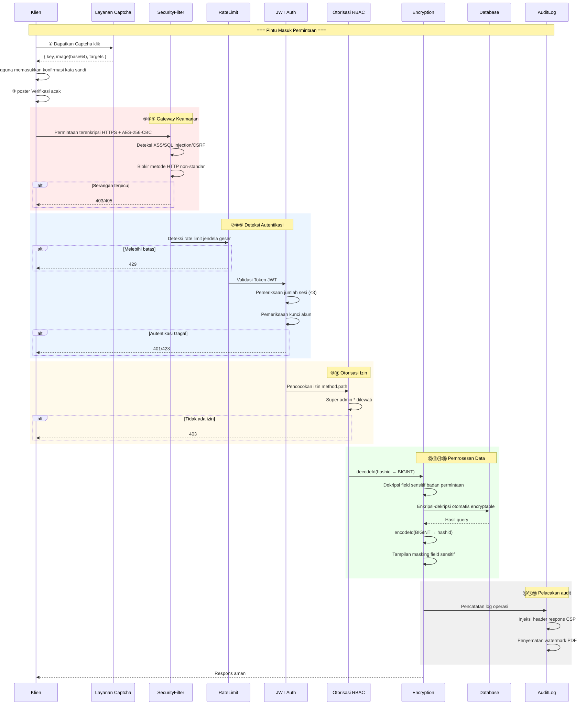

# Diagram Arsitektur Keamanan (Security Architecture Diagram)

> Copyright (c) 2026 erik <erik@erik.xyz> — https://erik.xyz

---

## 1. Panorama Pertahanan Berlapis 18 Lapis

---

## 2. Rantai Pemrosesan Keamanan Request

---

## 3. Rantai Lengkap Enkripsi Data

---

## 4. Model Autentikasi dan Otorisasi

---

## 5. Matriks Proteksi Permukaan Serangan

---

## 6. Sistem Audit Pelacakan

