# 不動産管理システム (Property Management Platform)

[日本語](../ja/README.md) | [中文](../../../README.md)

[English](docs/i18n/en/README.md) | [한국어](docs/i18n/ko/README.md) | [Русский](docs/i18n/ru/README.md) | [Deutsch](docs/i18n/de/README.md) | [Français](docs/i18n/fr/README.md) | [Español](docs/i18n/es/README.md) | [Português](docs/i18n/pt/README.md) | [हिन्दी](docs/i18n/hi/README.md) | [العربية](docs/i18n/ar/README.md) | [বাংলা](docs/i18n/bn/README.md) | [Bahasa Indonesia](docs/i18n/id/README.md) | [日本語](docs/i18n/ja/README.md) | 中文

> Copyright (c) 2026 erik <erik@erik.xyz> — https://erik.xyz


フルスタックの不動産管理システム。22の業務モジュール + 12の拡張機能（メッセージ通知/承認ワークフロー/決済/投票/SLA/データ大画面/督促/巡回点検/モール/顔認証/グループ管理/スマートQ&A）をカバーします。管理者端（admin）と所有者端（service）を分離してデプロイし、フロントエンドは Flutter Web（PC 管理画面スタイル）と HarmonyOS モバイル端に対応しています。

**小筑**（シャオジュー）は本プロジェクトのマスコットです — 灯りのついたマンションを擬人化したビル管理人で、インストールウィザード・エラーページ・ログインページ・アーキテクチャ図に登場します。

## プロジェクト構成

```
property-management-platform/
├── admin/                         # 管理者端 webman v2 プロジェクト
│   ├── app/
│   │   ├── admin/controller/      # 管理画面コントローラ
│   │   ├── api/v1/controller/     # 公開 API コントローラ
│   │   ├── common/                # 共通ユーティリティ
│   │   ├── middleware/            # ミドルウェア（認証/認可/レート制限/セキュリティ）
│   │   ├── model/                 # データモデル（Eloquent ORM）
│   │   ├── queue/                 # キュータスク
│   │   └── process/               # プロセス管理
│   ├── apps/
│   │   ├── flutter/               # 管理画面 Flutter Web（PC スタイル）
│   │   └── harmonyos/             # 管理画面 HarmonyOS App
│   ├── config/                    # 設定ファイル（中国語コメント付き）
│   ├── database/
│   │   └── backup/                # データベースバックアップスクリプト
│   ├── resource/
│   │   └── translations/          # 国際化言語ファイル（zh_CN / en）
│   ├── docs/                      # 管理者端ドキュメント
│   ├── tests/                     # ユニットテスト
│   └── public/                    # Web エントリ
├── service/                       # 所有者業務端 webman v2 プロジェクト
│   ├── app/
│   │   ├── api/v1/controller/     # 所有者端 API コントローラ
│   │   ├── common/                # 共通ユーティリティ
│   │   ├── middleware/            # ミドルウェア
│   │   ├── model/                 # データモデル
│   │   └── process/               # プロセス管理
│   ├── config/                    # 設定ファイル
│   ├── resource/
│   │   └── translations/          # 国際化言語ファイル
├── apps/
│   ├── flutter/                   # 所有者端 Flutter Web（PC スタイル）
│   └── harmonyos/                 # 所有者端 HarmonyOS App
└── docs/                          # プロジェクトドキュメント
    ├── ARCHITECTURE.md
    ├── ARCHITECTURE_DESIGN.md
    ├── ARCHITECTURE_DIAGRAM.md    # システムアーキテクチャ図
    ├── FLOWCHART.md               # 業務フローチャート
    ├── FUNCTION_DIAGRAM.md        # 機能モジュール図
    ├── LIFECYCLE_DIAGRAM.md       # ライフサイクル図
    ├── SECURITY_ARCHITECTURE.md   # セキュリティアーキテクチャ図
    ├── API.md
    ├── FEATURES.md
    └── FEATURE_DESIGN.md
```


## プロジェクト規模

| 層 | 数量 | 詳細 |
|----|------|------|
| データベーステーブル | 65 | 全て `management_` 接頭辞、BIGINT 非自動増分主キー |
| PHP モデル | admin 64 / service 57 | 全て Eloquent モデル、encryptable 暗号化フィールド含む；service 端 57 はモデルファイル数（BaseModel 基底クラス含む） |
| admin コントローラ | 58個 | 共通管理 + 22の不動産モジュール + 12の拡張機能 |
| service コントローラ | 17個 | 所有者端の全 API |
| API ルート | 178 | admin 125 + service 53 |
| Flutter 管理画面 | 42ページ | admin 42ページモジュール、96ファイル/6,662行 |
| Flutter 所有者端 | 13ページ | 料金/修理依頼/駐車/来訪者/イベント/通知/投票/モール/スマートQ&A/顔認証、32ファイル/3,582行 |
| HarmonyOS | 7ページ | ログイン/ホーム/請求書/修理依頼(2)/お知らせ/マイページ、11ファイル/927行 |
| テスト | 133個 | admin 90個(217アサーション) + service 43個(248アサーション) |

## システムアーキテクチャと設計図

> 以下は概要図です。詳細な図は [アーキテクチャ図](docs/ARCHITECTURE_DIAGRAM.md) · [フローチャート](docs/FLOWCHART.md) · [機能図](docs/FUNCTION_DIAGRAM.md) · [ライフサイクル図](docs/LIFECYCLE_DIAGRAM.md) · [セキュリティアーキテクチャ図](docs/SECURITY_ARCHITECTURE.md) を参照してください

### システム全景アーキテクチャ


### 機能モジュール総覧


### データエンティティライフサイクル


### コア業務フロー



### 18層セキュリティ多層防御



## 機能モジュール（22大モジュール + 12拡張）

| バッチ | モジュール | ステータス |
|------|------|------|
| 第1バッチ | コミュニティ、棟、部屋、間取りタイプ、不動産、所有者、テナント、料金、修理依頼、お知らせ（10モジュール） | ✅ 全て完了 |
| 第2バッチ | 駐車、設備、苦情、来訪者、契約、財務（6モジュール）+ パネル可視化 + Excel/PDFエクスポート（プラットフォーム機能） | ✅ 全て完了 |
| 第3バッチ | 警備巡回、清掃、緑化、コミュニティイベント、エネルギー、スタッフ（6モジュール） | ✅ 全て完了 |
| 拡張 | メッセージ通知、承認ワークフロー、決済統合、所有者投票、SLA自動エスカレーション、データ大画面、スマート督促、巡回点検モバイル、コミュニティモール、顔認証、多小区グループ管理、スマートQ&A（12モジュール） | ✅ 全て完了 |
| プラットフォーム機能 | レポートセンター（収支トレンド/収納率/業務分布/滞納ランキング/PDFエクスポート）+ 所有者ホーム統計（苦情/イベント/投票/未読） | ✅ 全て完了 |

## 技術スタック

### バックエンド
- **フレームワーク**: webman v2 (workerman/webman)
- **言語**: PHP 8.3+
- **データベース**: MySQL 8.0+、テーブル接頭辞 `management_`、主キー BIGINT 非自動増分
- **検索エンジン**: Elasticsearch 8.x
- **キャッシュ**: Redis 7.x

### コア依存
| パッケージ名 | 用途 |
|------|------|
| `erikwang2013/snowflake-php` | グローバル一意 BIGINT 主キー生成 |
| `erikwang2013/hashids` | API 層 ID 暗号化/復号 |
| `erikwang2013/jwt-webman` | JWT 認証（HS256） |
| `erikwang2013/encryption` | API 転送時の機密データ AES-256-CBC 暗号化 |
| `erikwang2013/encryptable` | データベース機密フィールド暗号化/復号 |
| `erikwang2013/webman-scout` | Elasticsearch データ同期と全文検索 |
| `erikwang2013/season` | 国旗データ |
| `erikwang2013/security-php` | セキュリティツール検出 |
| `erikwang2013/poster-php` | 機密操作ランダム認証コード |
| `phpoffice/phpspreadsheet` | Excel エクスポート |
| `barryvdh/laravel-dompdf` | PDF エクスポート |
| `hg/apidoc` | API インターフェースドキュメント自動生成 |

### フロントエンド
- **Flutter 3.x** + GetX（i18n 含む） + Dio + fl_chart — PC スタイル Web 管理画面
- **HarmonyOS ArkTS** + @ohos.net.http — モバイル端 App

### API ドキュメント

全 API エンドポイントとパラメータ説明は独立ドキュメント [docs/API.md](docs/API.md) を参照してください。サービス起動後、apidoc が自動生成したインタラクティブドキュメントにもアクセスできます：

| 端 | アドレス | グループ |
|----|------|------|
| 管理端 | `http://localhost:8787/apidoc` | 10グループ（common/dashboard/system/property-core/property-aux/property-adv/extensions/export/import/upload） |
| 所有者端 | `http://localhost:8788/apidoc` | 9グループ（公開インターフェース/ホーム/料金/修理依頼/フィードバック/駐車/イベント/個人/拡張） |

### 国際化

- **PHP バックエンド**: symfony/translation、言語ファイルは `resource/translations/{zh_CN,en}/messages.php`
- **Flutter Web**: GetX `Translations`、`apps/flutter/lib/i18n/messages.dart`
- **デフォルト言語**: 簡体中文（zh_CN）、英語（en）切替対応
- **リクエストヘッダー**: `Accept-Language` リクエストヘッダーによる応答言語の制御に対応

## セキュリティ体系（18層多層防御）

1. クリック認証コード → 2. パスワード再確認 → 3. poster ランダム認証 → 4. security-php セキュリティスキャン → 5. SecurityFilter 攻撃ブロック → 6. HTTPS + AES-256-CBC 転送暗号化 → 7. JWT HS256 認証 → 8. 同時セッション制限(最大3つ) → 9. アカウントロック(15分間に5回失敗) → 10. RBAC 権限認可(method.path 粒度) → 11. Redis スライディングウィンドウレート制限 → 12. Hashids ID 保護 → 13. リクエストボディ機密フィールド暗号化 → 14. DB フィールド暗号化保存 → 15. 表示層データマスキング → 16. 操作ログ全量監査(8プラットフォーム送信元) → 17. CSP ヘッダー防御 → 18. PDF 著作権ウォーターマーク

## コード規約

- 全ての新規ファイル先頭に著作権宣言：`Copyright (c) 2026 erik <erik@erik.xyz> — https://erik.xyz`
- グローバル関数/クラス参照は `use` でインポートし、前置 `\` を付けない
- 設定ファイルには各設定項目の中国語コメントを含める
- 主キー ID は BIGINT UNSIGNED NOT NULL を使用し、snowflake-php アプリケーション層で生成
- API 転送 ID は hashids で暗号化/復号

## クイックスタート
### ⚡ ワンクリックインストール（最速）

```bash
bash scripts/deploy.sh
# 自動: git pull → .env と鍵を生成 → Docker Compose 起動 → DB初期化（冪等）→ 監視スモークテスト
# 管理端 http://localhost:8787 · 業務端 http://localhost:8788
```

> Docker + Docker Compose が必要。冪等で再実行可能。詳細は [scripts/deploy.sh](scripts/deploy.sh)。


### 方法1：Web インストールウィザード（推奨）

管理端を起動後 `http://localhost:8787/install` にアクセスし、画面操作でデータベース設定と管理画面管理者アカウントを作成します。

```bash
cd admin
cp .env.example .env
composer install
php start.php start -d
# http://localhost:8787/install にアクセスしてインストール完了
```

詳細は [インストールガイド](docs/INSTALL.md) を参照してください。

### 方法2：手動インストール

#### 環境要件

- PHP 8.1+
- MySQL 8.0+
- Redis 6.0+
- Composer 2.x
- Flutter SDK 3.x（フロントエンド開発）

#### 1. データベース初期化

```bash
mysql -u root -e "CREATE DATABASE IF NOT EXISTS management DEFAULT CHARSET utf8mb4 COLLATE utf8mb4_unicode_ci;"
mysql -u root management < docs/install.sql
```

#### 2. 管理端の起動

```bash
cd admin
cp .env.example .env
# .env を編集してデータベースパスワードなどの設定を変更
composer install
php start.php start -d
# 管理端は http://localhost:8787 で稼働
```

### 3. 業務端の起動

```bash
cd service
cp .env.example .env
# .env を編集してデータベースパスワードなどの設定を変更
composer install
php start.php start -d
# 業務端は http://localhost:8788 で稼働
```

### 4. フロントエンドの起動（開発）

```bash
cd apps/flutter
flutter pub get
flutter run -d chrome
```

### 5. テストの実行

```bash
# 管理端テスト
cd admin && php vendor/bin/phpunit

# 業務端テスト
cd service && php vendor/bin/phpunit
```

| プロジェクト | テスト数 | アサーション数 | 合格率 |
|------|--------|--------|--------|
| admin | 90 | 217 | 100% |
| service | 43 | 248 | 100% (1個スキップ) |
| **合計** | **133** | **465** | — |

service テストカバレッジ: Snowflake ID、Hashids エンコード/デコード、レスポンス形式、データベース Schema、i18n 翻訳ファイル

### Docker デプロイ

```bash
cd admin
cp .env.docker .env
docker-compose up -d
# Nginx + PHP + MySQL + Redis + Elasticsearch を含む
```

## デプロイトポロジー

```
Nginx (:443) → admin webman (:8787) + service webman (:8788) → MySQL + Redis + Elasticsearch
静的ファイル: Flutter Web build/
```

## 使い方

### 管理画面
1. `http://localhost:8787` を開き、デフォルト管理者アカウントでログイン。
2. 基本データ: 小区 → 建物 → ユニット → 間取り → 物件 → 所有者を紐付け。
3. 日常業務: 料金設定、請求書生成、収納; 修理（アサイン/進捗）; 苦情（対応/訪問）; レポートセンターで収支と収納率を確認。
4. システム: 管理者追加、RBAC、設定、監査ログ。

### 所有者ポータル
`http://localhost:8788`（または Flutter Web / HarmonyOS）を開く: ホームに物件・未納・修理・苦情・イベント・投票・未読を表示。

## デフォルト管理者

| ユーザー名 | パスワード | ロール |
|--------|------|------|
| admin | admin123 | スーパー管理者 |

> 本番環境では直ちにデフォルトパスワードを変更してください。

## ドキュメントインデックス

| ドキュメント | 説明 |
|------|------|
| [インストールガイド](docs/INSTALL.md) | ゼロからのデプロイガイド、データベース初期化、Docker デプロイ、よくある問題 |
| [統合インストールスクリプト](docs/install.sql) | 全 65 テーブル + RBAC 権限シードデータ、ワンクリックインポート |
| [バージョン比較](docs/EDITIONS.md) | ベーシック版(Lite) / スタンダード版(Standard) / フル版(Full) の機能と技術指標の比較 |
| [アーキテクチャ設計ドキュメント](docs/ARCHITECTURE_DESIGN.md) | システム階層アーキテクチャ、ミドルウェア実行チェーン、セキュリティ多層防御設計 |
| [アーキテクチャドキュメント](docs/ARCHITECTURE.md) | Mermaid アーキテクチャ図（システムトポロジー、リクエストライフサイクル、データ暗号化、デプロイ） |
| [システムアーキテクチャ図](docs/ARCHITECTURE_DIAGRAM.md) | 全景アーキテクチャ、階層詳細図、デプロイアーキテクチャ（Mermaid 可視化） |
| [業務フローチャート](docs/FLOWCHART.md) | 認証フロー、料金管理、修理依頼処理、不動産管理、苦情、来訪者 |
| [機能モジュール図](docs/FUNCTION_DIAGRAM.md) | 34モジュール全景、依存関係、管理画面機能ツリー、所有者端機能マップ |
| [ライフサイクル図](docs/LIFECYCLE_DIAGRAM.md) | リクエストライフサイクル、エンティティライフサイクル、Tokenライフサイクル、CRUD 全フロー |
| [セキュリティアーキテクチャ図](docs/SECURITY_ARCHITECTURE.md) | 18層多層防御全景、攻撃面防御マトリクス、暗号化全チェーン、監査トレーサビリティ体系 |
| [機能設計ドキュメント](docs/FEATURE_DESIGN.md) | 34モジュール機能仕様説明 |
| [機能ドキュメント](docs/FEATURES.md) | 機能一覧とモジュール概要 |
| [API ドキュメント](docs/API.md) | 全 API エンドポイントとパラメータ説明 |

## プロジェクト支援

ご支援ありがとうございます！

|  |  |
|:---:|:---:|
| WeChat Pay | Alipay |

### グローバル振込による寄付

世界中からの銀行振込に対応しています。受取口座は香港 ZA Bank（众安银行）です：

| 項目 | 情報 |
|------|------|
| 受取人名義 | WANG KEXUN |
| 受取口座番号 | 881015918251 |
| 受取銀行 | ZA Bank Limited |
| SWIFT Code | AABLHKHHXXX |
| 銀行番号 | 387 |
| 銀行住所 | Core F, Cyberport 3, 100 Cyberport Road, Hong Kong |

> **クロスボーダー送金代理銀行（中継銀行）**：以下は代理銀行（中継銀行）の情報であり、受取銀行の情報ではありません。送金銀行に代理銀行情報の提供が必要かどうかお問い合わせください。
>
> - **香港ドル・人民元・米ドル**（Citibank N.A. Hong Kong）：SWIFT `CITIHKXXXX`、銀行番号 006、支店番号 391、住所：Citibank Tower, Citibank Plaza, 3 Garden Road, Central, Hong Kong
> - **その他の通貨**（THE BANK OF NEW YORK MELLON）：SWIFT `IRVTUS3NXXX`、住所：240 GREENWICH STREET, NEW YORK, United States

### 仮想通貨の寄付 (Crypto Donation)

このプロジェクトがお役に立ったら、QRコードをスキャンして寄付してください。ありがとうございます！

| <br>**BNB Smart Chain (BEP20)**<br>`0x355d429f97511897ccb4e271ec888205f9ab6629` | <br>**Tron (TRC20)**<br>`TEdDHWLajt1XvqtPDWmQctdrJaC3pzZZzz` |
| <br>**Ethereum (ERC20)**<br>`0x355d429f97511897ccb4e271ec888205f9ab6629` | <br>**Aptos**<br>`0x836e3780edfc3f7b2372b39e2a1a3a5d7adfaccd96c726f21cfde1b50dd68030` |
| <br>**Plasma**<br>`0x355d429f97511897ccb4e271ec888205f9ab6629` | <br>**Polygon POS**<br>`0x355d429f97511897ccb4e271ec888205f9ab6629` |
| <br>**Solana**<br>`2hfhboHdmdrYsY25XfQSsEWxq5ip4EQsR7f4AzSRMUyr` | <br>**The Open Network (TON)**<br>`UQB9kFQohzmXUir9QSSZq01iwl9aQZIDdBpNmDklljRtCoGK` |
| <br>**Arbitrum One**<br>`0x355d429f97511897ccb4e271ec888205f9ab6629` | <br>**AVAX C-Chain**<br>`0x355d429f97511897ccb4e271ec888205f9ab6629` |

本プロジェクトへのご支援を歓迎します！

## License

MIT License. See [LICENSE](LICENSE) for details.
