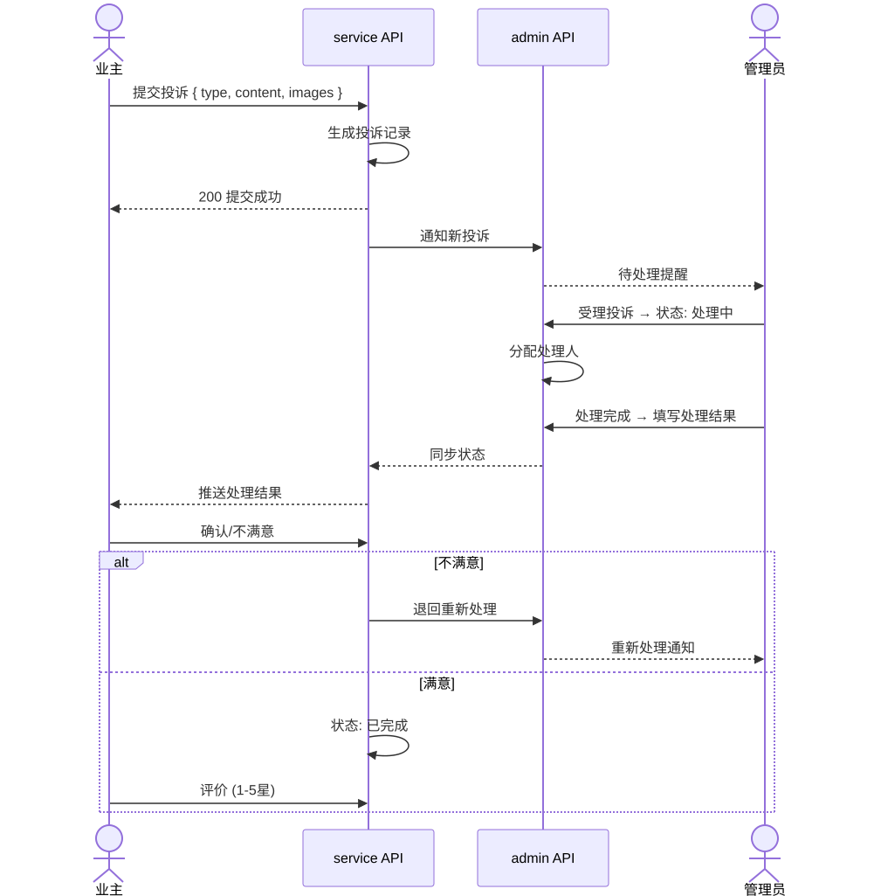

# 業務フローチャート (Business Flowchart)

> Copyright (c) 2026 erik <erik@erik.xyz> — https://erik.xyz

---

## 1. ユーザー認証フロー

---

## 2. コア業務フロー — 料金管理

---

## 3. 修理依頼処理フロー

---

## 4. 不動産管理フロー

---

## 5. 苦情・提案処理フロー

---

## 6. 来訪者通行フロー

