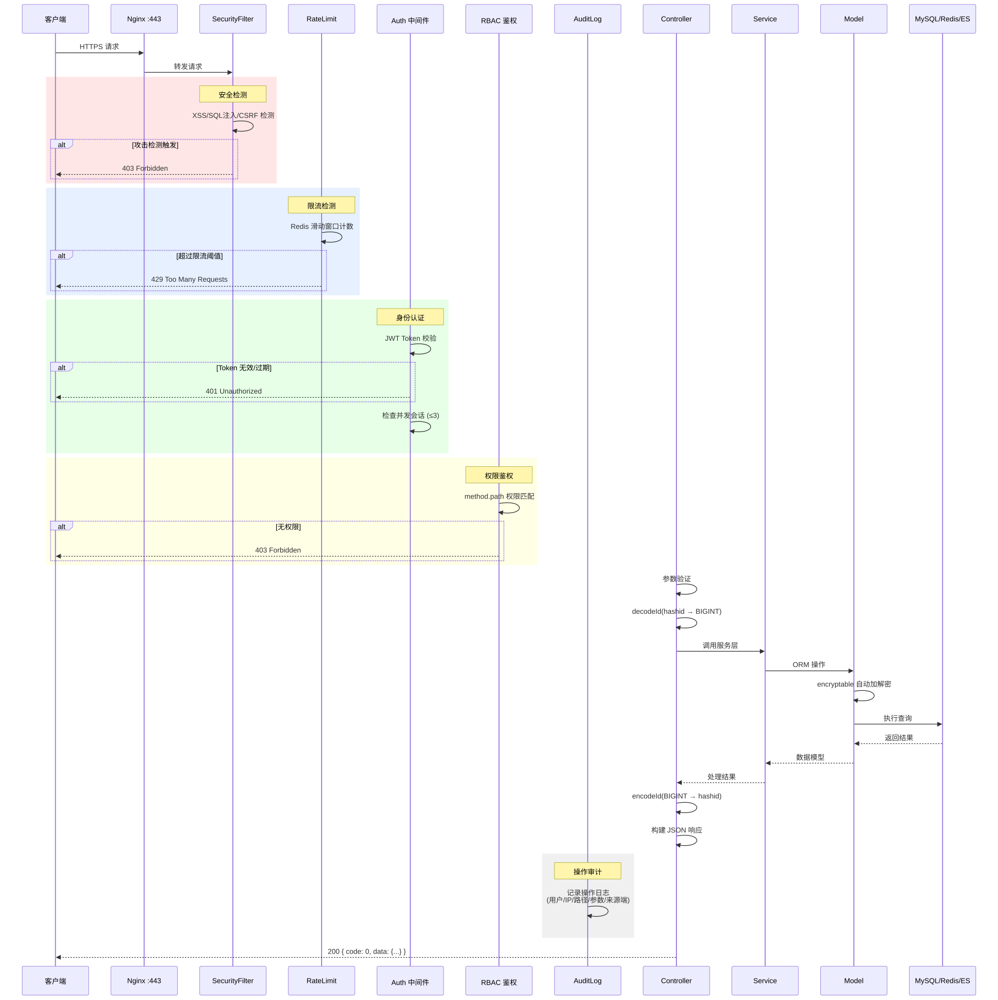
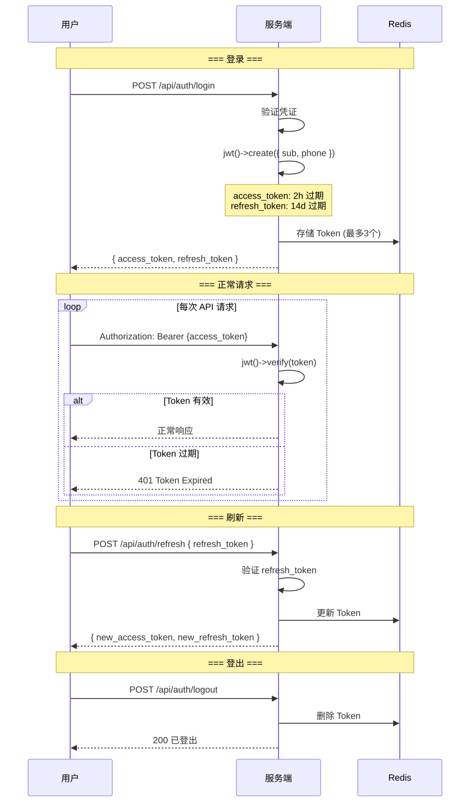

# ライフサイクル図 (Lifecycle Diagram)

> Copyright (c) 2026 erik <erik@erik.xyz> — https://erik.xyz

> English edition: `../../../images/design_lifecycle_en.svg`

---

## 1. リクエストライフサイクル

---

## 2. データエンティティライフサイクル — 所有者 (Owner)

---

## 3. データエンティティライフサイクル — 料金請求書 (Fee Bill)

---

## 4. データエンティティライフサイクル — 修理依頼チケット (Repair Order)

---

## 5. JWT Token ライフサイクル

---

## 6. データベースレコード完全ライフサイクル

