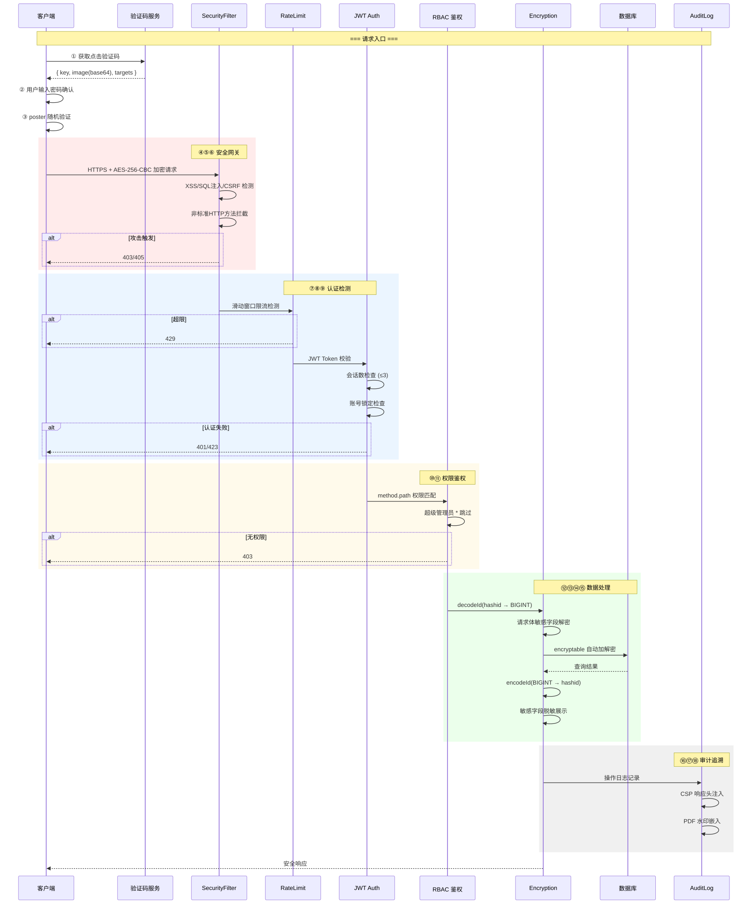

# セキュリティアーキテクチャ図 (Security Architecture Diagram)

> Copyright (c) 2026 erik <erik@erik.xyz> — https://erik.xyz

---

## 1. 18層多層防御全景

---

## 2. リクエストセキュリティ処理チェーン

---

## 3. データ暗号化全チェーン

---

## 4. 認証と認可モデル

---

## 5. 攻撃面防御マトリクス

---

## 6. 監査トレーサビリティ体系

