# 부동산 관리 시스템 (Property Management Platform)

[한국어](../ko/README.md) | [中文](../../../README.md)

> Copyright (c) 2026 erik <erik@erik.xyz> — https://erik.xyz

풀스택 부동산 관리 시스템으로, 22개 업무 모듈 + 12개 확장 기능(메시지 알림/승인 워크플로/결제/투표/SLA/데이터 스크린/납부 독촉/순찰/몰/얼굴 인식/그룹/스마트 Q&A)을 포함합니다. 관리자(admin)와 입주민(service) 포털이 분리 배포되며, 프런트엔드는 Flutter Web(PC 관리자 콘솔 스타일)과 HarmonyOS 모바일을 지원합니다.

## 프로젝트 구조

```
property-management-platform/
├── admin/                         # 관리자 webman v2 프로젝트
│   ├── app/
│   │   ├── admin/controller/      # 관리자 컨트롤러
│   │   ├── api/v1/controller/     # 공개 API 컨트롤러
│   │   ├── common/                # 공통 유틸리티 클래스
│   │   ├── middleware/            # 미들웨어(인증/권한/속도 제한/보안)
│   │   ├── model/                 # 데이터 모델(Eloquent ORM)
│   │   ├── queue/                 # 큐 작업
│   │   └── process/               # 프로세스 관리
│   ├── apps/
│   │   ├── flutter/               # 관리자 Flutter Web(PC 스타일)
│   │   └── harmonyos/             # 관리자 HarmonyOS App
│   ├── config/                    # 설정 파일(중국어 주석 포함)
│   ├── database/
│   │   └── backup/                # 데이터베이스 백업 스크립트
│   ├── resource/
│   │   └── translations/          # i18n 언어 파일(zh_CN / en)
│   ├── docs/                      # 관리자 문서
│   ├── tests/                     # 단위 테스트
│   └── public/                    # Web 진입점
├── service/                       # 입주민 포털 webman v2 프로젝트
│   ├── app/
│   │   ├── api/v1/controller/     # 입주민 API 컨트롤러
│   │   ├── common/                # 공통 유틸리티 클래스
│   │   ├── middleware/            # 미들웨어
│   │   ├── model/                 # 데이터 모델
│   │   └── process/               # 프로세스 관리
│   ├── config/                    # 설정 파일
│   ├── resource/
│   │   └── translations/          # i18n 언어 파일
├── apps/
│   ├── flutter/                   # 입주민 Flutter Web(PC 스타일)
│   └── harmonyos/                 # 입주민 HarmonyOS App
└── docs/                          # 프로젝트 문서
    ├── ARCHITECTURE.md
    ├── ARCHITECTURE_DESIGN.md
    ├── ARCHITECTURE_DIAGRAM.md    # 시스템 아키텍처 다이어그램
    ├── FLOWCHART.md               # 비즈니스 흐름 다이어그램
    ├── FUNCTION_DIAGRAM.md        # 기능 모듈 다이어그램
    ├── LIFECYCLE_DIAGRAM.md       # 라이프사이클 다이어그램
    ├── SECURITY_ARCHITECTURE.md   # 보안 아키텍처 다이어그램
    ├── API.md
    ├── FEATURES.md
    └── FEATURE_DESIGN.md
```

## 프로젝트 규모

| 레이어 | 수량 | 상세 |
|----|------|------|
| 데이터베이스 테이블 | 65개 | 전부 `management_` 접두사, BIGINT 비자동증가 기본 키 |
| PHP 모델 | admin 64 / service 57 | 모두 Eloquent 모델, encryptable 암호화 필드 포함; service 57은 모델 파일 수(BaseModel 베이스 클래스 포함) |
| admin 컨트롤러 | 58개 | 공통 관리 + 22개 부동산 모듈 + 12개 확장 기능 |
| service 컨트롤러 | 17개 | 입주민 포털 전체 API |
| API 라우트 | 178 | admin 125 + service 53 |
| Flutter 관리자 | 42페이지 | admin 42개 페이지 모듈, 96파일/6,662줄 |
| Flutter 입주민 | 13페이지 | 요금/수리/주차/방문객/활동/알림/투표/몰/스마트 Q&A/얼굴 인식, 32파일/3,582줄 |
| HarmonyOS | 7페이지 | 로그인/홈/청구서/수리(2)/공지/마이페이지, 11파일/927줄 |
| 테스트 | 133개 | admin 90개(217단언) + service 43개(248단언) |

## 시스템 아키텍처 및 설계 다이어그램

> 아래는 개요도이며, 상세 다이어그램은 [아키텍처 다이어그램](docs/ARCHITECTURE_DIAGRAM.md) · [흐름 다이어그램](docs/FLOWCHART.md) · [기능 다이어그램](docs/FUNCTION_DIAGRAM.md) · [라이프사이클 다이어그램](docs/LIFECYCLE_DIAGRAM.md) · [보안 아키텍처 다이어그램](docs/SECURITY_ARCHITECTURE.md) 참조

### 시스템 전체 아키텍처



### 핵심 비즈니스 흐름



### 기능 모듈 총괄



### 데이터 엔티티 라이프사이클



### 18단계 보안 심층 방어



## 기능 모듈(22개 대모듈 + 12개 확장)

| 배치 | 모듈 | 상태 |
|------|------|------|
| 1차 | 단지, 동, 호, 세대 유형, 부동산, 입주민, 임차인, 요금, 수리 접수, 공지(10개 모듈) | ✅ 전부 완료 |
| 2차 | 주차, 설비, 민원, 방문객, 계약, 재무(6개 모듈) + 패널 시각화 + Excel/PDF 내보내기(플랫폼 기능) | ✅ 전부 완료 |
| 3차 | 경비 순찰, 청소, 조경, 커뮤니티 활동, 에너지, 직원(6개 모듈) | ✅ 전부 완료 |
| 확장 | 메시지 알림, 승인 워크플로, 결제 연동, 입주민 투표, SLA 자동 승격, 데이터 스크린, 스마트 납부 독촉, 모바일 순찰, 커뮤니티 몰, 얼굴 인식, 다단지 그룹 관리, 스마트 Q&A(12개 모듈) | ✅ 전부 완료 |

## 기술 스택

### 백엔드
- **프레임워크**: webman v2 (workerman/webman)
- **언어**: PHP 8.3+
- **데이터베이스**: MySQL 8.0+, 테이블 접두사 `management_`, 기본 키 BIGINT 비자동증가
- **검색 엔진**: Elasticsearch 8.x
- **캐시**: Redis 7.x

### 핵심 의존성
| 패키지 | 용도 |
|------|------|
| `erikwang2013/snowflake-php` | 전역 고유 BIGINT 기본 키 생성 |
| `erikwang2013/hashids` | API 레이어 ID 암/복호화 |
| `erikwang2013/jwt-webman` | JWT 인증(HS256) |
| `erikwang2013/encryption` | API 전송 민감 데이터 AES-256-CBC 암호화 |
| `erikwang2013/encryptable` | 데이터베이스 민감 필드 암/복호화 |
| `erikwang2013/webman-scout` | Elasticsearch 데이터 동기화 및 전문 검색 |
| `erikwang2013/season` | 국가 국기 데이터 |
| `erikwang2013/security-php` | 보안 도구 탐지 |
| `erikwang2013/poster-php` | 민감 작업 랜덤 캡차 |
| `phpoffice/phpspreadsheet` | Excel 내보내기 |
| `barryvdh/laravel-dompdf` | PDF 내보내기 |
| `hg/apidoc` | API 문서 자동 생성 |

### 프런트엔드
- **Flutter 3.x** + GetX(i18n 포함) + Dio + fl_chart — PC 스타일 Web 관리자 콘솔
- **HarmonyOS ArkTS** + @ohos.net.http — 모바일 App

### API 문서

전체 API 엔드포인트와 파라미터 설명은 별도 문서 [docs/API.md](docs/API.md) 참조. 서비스 시작 후 apidoc으로 자동 생성된 대화형 문서도 접근 가능:

| 포털 | 주소 | 그룹 |
|----|------|------|
| 관리자 | `http://localhost:8787/apidoc` | 10개 그룹(common/dashboard/system/property-core/property-aux/property-adv/extensions/export/import/upload) |
| 입주민 | `http://localhost:8788/apidoc` | 9개 그룹(공개 인터페이스/홈/요금/수리/피드백/주차/활동/개인/확장) |

### 국제화

- **PHP 백엔드**: symfony/translation, 언어 파일은 `resource/translations/{zh_CN,en}/messages.php`
- **Flutter Web**: GetX `Translations`, `apps/flutter/lib/i18n/messages.dart`
- **기본 언어**: 중국어 간체(zh_CN), 영어(en) 전환 지원
- **요청 헤더**: `Accept-Language` 요청 헤더로 응답 언어 제어 지원

## 보안 체계(18단계 심층 방어)

1. 클릭 캡차 → 2. 비밀번호 재확인 → 3. poster 랜덤 검증 → 4. security-php 보안 스캔 → 5. SecurityFilter 공격 차단 → 6. HTTPS + AES-256-CBC 전송 암호화 → 7. JWT HS256 인증 → 8. 동시 세션 제한(최대 3개) → 9. 계정 잠금(5회 실패/15분) → 10. RBAC 권한 검증(method.path 단위) → 11. Redis 슬라이딩 윈도우 속도 제한 → 12. Hashids ID 보호 → 13. 요청 본문 민감 필드 암호화 → 14. DB 필드 암호화 저장 → 15. 표시 레이어 데이터 마스킹 → 16. 작업 로그 전체 감사(8개 플랫폼 소스) → 17. CSP 헤더 보호 → 18. PDF 저작권 워터마크

## 코드 규칙

- 모든 새 파일 헤더에 저작권 문구 포함: `Copyright (c) 2026 erik <erik@erik.xyz> — https://erik.xyz`
- 전역 함수/클래스 참조는 `use`로 가져오고 앞에 `\`를 붙이지 않음
- 설정 파일은 각 설정 항목에 대한 중국어 주석 포함
- 기본 키 ID는 BIGINT UNSIGNED NOT NULL, snowflake-php 애플리케이션 레이어에서 생성
- API 전송 ID는 hashids로 암/복호화

## 빠른 시작

### 방법 1: Web 설치 마법사(권장)

관리자 시작 후 `http://localhost:8787/install`에 접속하여 화면에서 데이터베이스 설정과 관리자 계정 생성을 완료합니다.

```bash
cd admin
cp .env.example .env
composer install
php start.php start -d
# http://localhost:8787/install 접속하여 설치 완료
```

자세한 내용은 [설치 가이드](docs/INSTALL.md) 참조.

### 방법 2: 수동 설치

#### 환경 요구사항

- PHP 8.1+
- MySQL 8.0+
- Redis 6.0+
- Composer 2.x
- Flutter SDK 3.x(프런트엔드 개발)

#### 1. 데이터베이스 초기화

```bash
mysql -u root -e "CREATE DATABASE IF NOT EXISTS management DEFAULT CHARSET utf8mb4 COLLATE utf8mb4_unicode_ci;"
mysql -u root management < docs/install.sql
```

#### 2. 관리자 시작

```bash
cd admin
cp .env.example .env
# .env 편집하여 데이터베이스 비밀번호 등 설정
composer install
php start.php start -d
# 관리자는 http://localhost:8787 에서 실행
```

### 3. 입주민 포털 시작

```bash
cd service
cp .env.example .env
# .env 편집하여 데이터베이스 비밀번호 등 설정
composer install
php start.php start -d
# 입주민 포털은 http://localhost:8788 에서 실행
```

### 4. 프런트엔드 시작(개발)

```bash
cd apps/flutter
flutter pub get
flutter run -d chrome
```

### 5. 테스트 실행

```bash
# 관리자 테스트
cd admin && php vendor/bin/phpunit

# 입주민 포털 테스트
cd service && php vendor/bin/phpunit
```

| 프로젝트 | 테스트 수 | 단언 수 | 통과율 |
|------|--------|--------|--------|
| admin | 90 | 217 | 100% |
| service | 43 | 248 | 100% (1개 스킵) |
| **합계** | **133** | **465** | — |

service 테스트 커버리지: Snowflake ID, Hashids 인코딩/디코딩, 응답 형식, 데이터베이스 Schema, i18n 번역 파일

### Docker 배포

```bash
cd admin
cp .env.docker .env
docker-compose up -d
# Nginx + PHP + MySQL + Redis + Elasticsearch 포함
```

## 배포 토폴로지

```
Nginx (:443) → admin webman (:8787) + service webman (:8788) → MySQL + Redis + Elasticsearch
정적 파일: Flutter Web build/
```

## 기본 관리자

| 사용자명 | 비밀번호 | 역할 |
|--------|------|------|
| admin | admin123 | 슈퍼 관리자 |

> 운영 환경에서는 즉시 기본 비밀번호를 변경하세요.

## 문서 인덱스

| 문서 | 설명 |
|------|------|
| [설치 가이드](docs/INSTALL.md) | 처음부터 배포하는 가이드, 데이터베이스 초기화, Docker 배포, 자주 묻는 질문 |
| [통합 설치 스크립트](docs/install.sql) | 전체 65개 테이블 + RBAC 권한 시드 데이터, 원클릭 임포트 |
| [버전 비교](docs/EDITIONS.md) | 라이트(Lite) / 스탠다드(Standard) / 풀(Full) 기능 및 기술 지표 비교 |
| [아키텍처 설계 문서](docs/ARCHITECTURE_DESIGN.md) | 시스템 계층 아키텍처, 미들웨어 실행 체인, 보안 심층 방어 설계 |
| [아키텍처 문서](docs/ARCHITECTURE.md) | Mermaid 아키텍처 다이어그램(시스템 토폴로지, 요청 라이프사이클, 데이터 암호화, 배포) |
| [시스템 아키텍처 다이어그램](docs/ARCHITECTURE_DIAGRAM.md) | 전체 아키텍처, 계층 상세, 배포 아키텍처(Mermaid 시각화) |
| [비즈니스 흐름 다이어그램](docs/FLOWCHART.md) | 인증 프로세스, 요금 관리, 수리 처리, 부동산 관리, 민원, 방문객 |
| [기능 모듈 다이어그램](docs/FUNCTION_DIAGRAM.md) | 34개 모듈 전체, 의존 관계, 관리자 기능 트리, 입주민 기능 맵 |
| [라이프사이클 다이어그램](docs/LIFECYCLE_DIAGRAM.md) | 요청 라이프사이클, 엔티티 라이프사이클, 토큰 라이프사이클, CRUD 전체 프로세스 |
| [보안 아키텍처 다이어그램](docs/SECURITY_ARCHITECTURE.md) | 18단계 심층 방어 전체, 공격면 보호 매트릭스, 암호화 전체 체인, 감사 추적 체계 |
| [기능 설계 문서](docs/FEATURE_DESIGN.md) | 34개 모듈 기능 사양 설명 |
| [기능 문서](docs/FEATURES.md) | 기능 목록과 모듈 개요 |
| [인터페이스 문서](docs/API.md) | 전체 API 엔드포인트와 파라미터 설명 |

## 후원

지원해 주셔서 감사합니다!

|  |  |
|:---:|:---:|
| 위챗페이 | 알리페이 |

### 글로벌 송금 후원

전 세계 은행 송금을 지원하며, 수취 계좌는 홍콩 ZA Bank(중안은행)입니다:

| 항목 | 정보 |
|------|------|
| 수취인 이름 | WANG KEXUN |
| 수취 계좌 번호 | 881015918251 |
| 수취 은행 | ZA Bank Limited |
| SWIFT Code | AABLHKHHXXX |
| 은행 번호 | 387 |
| 은행 주소 | Core F, Cyberport 3, 100 Cyberport Road, Hong Kong |

> **해외 송금 대리 은행(중개 은행)**: 아래는 대리 은행(중개 은행) 정보이며 수취 은행 정보가 아닙니다. 송금 은행에 대리 은행 정보가 필요한지 문의하세요.
>
> - **홍콩달러, 위안화, 달러 송금**(Citibank N.A. Hong Kong): SWIFT `CITIHKXXXX`, 은행 번호 006, 지점 번호 391, 주소: Citibank Tower, Citibank Plaza, 3 Garden Road, Central, Hong Kong
> - **기타 통화 송금**(THE BANK OF NEW YORK MELLON): SWIFT `IRVTUS3NXXX`, 주소: 240 GREENWICH STREET, NEW YORK, United States

이 프로젝트에 대한 지원을 환영합니다!

## License

MIT License. 자세한 내용은 [LICENSE](LICENSE) 참조.
