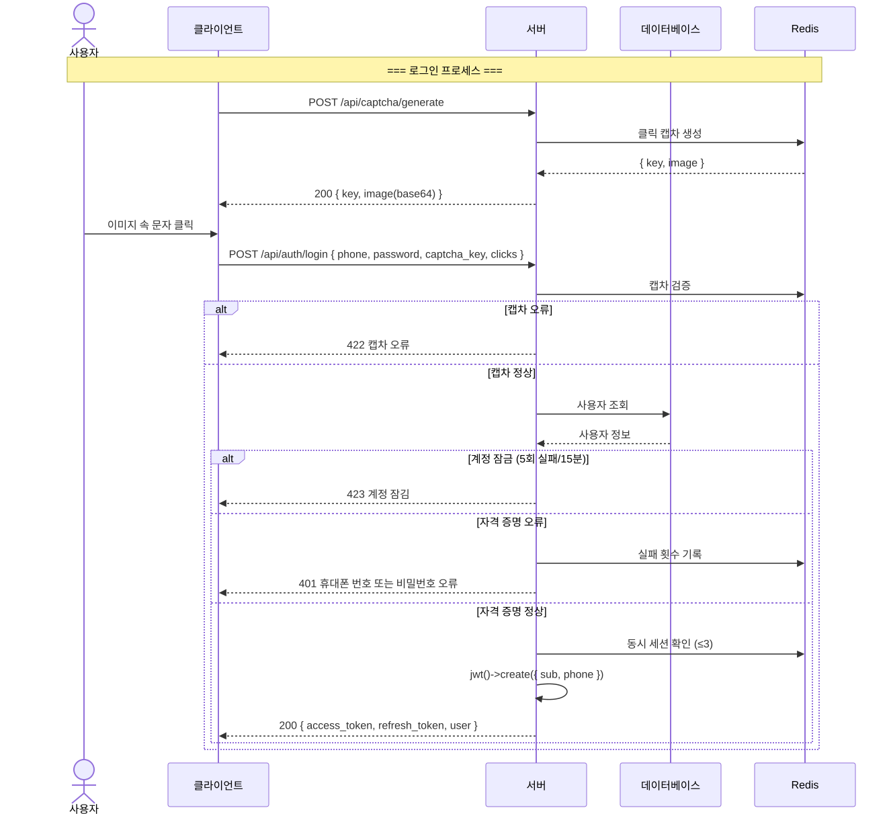
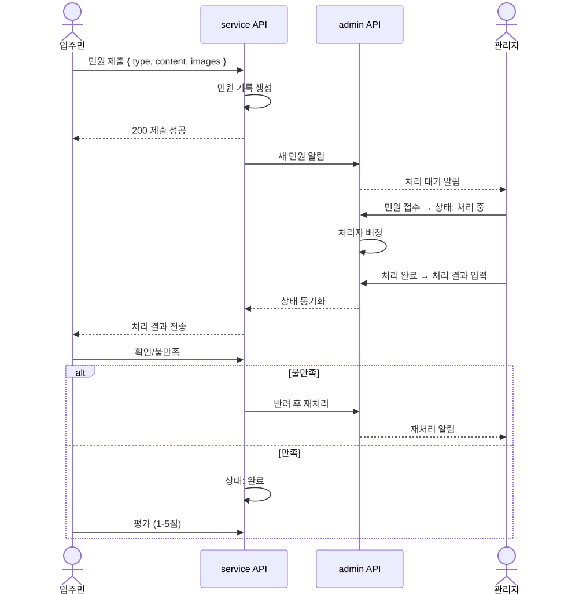

# 비즈니스 흐름 다이어그램 (Business Flowchart)

> Copyright (c) 2026 erik <erik@erik.xyz> — https://erik.xyz

---

## 1. 사용자 인증 프로세스

---

## 2. 핵심 비즈니스 흐름 — 요금 관리

---

## 3. 수리 처리 프로세스

---

## 4. 부동산 관리 프로세스

---

## 5. 민원/제안 처리 프로세스

---

## 6. 방문객 통행 프로세스

