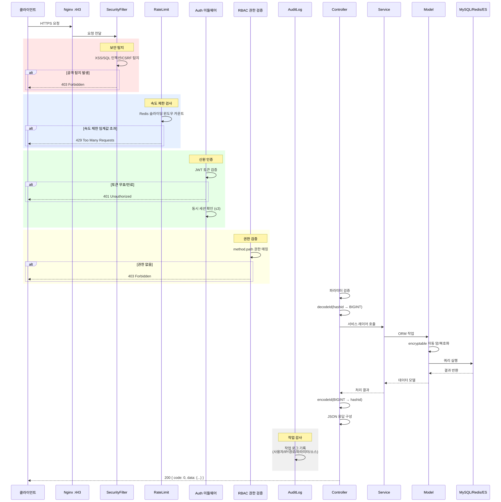
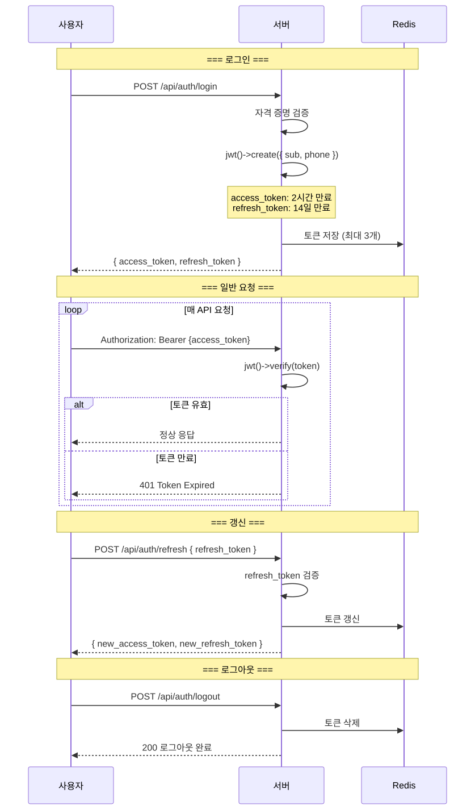

# 라이프사이클 다이어그램 (Lifecycle Diagram)

> Copyright (c) 2026 erik <erik@erik.xyz> — https://erik.xyz

---

## 1. 요청 라이프사이클

---

## 2. 데이터 엔티티 라이프사이클 — 입주민 (Owner)

---

## 3. 데이터 엔티티 라이프사이클 — 요금 청구서 (Fee Bill)

---

## 4. 데이터 엔티티 라이프사이클 — 수리 티켓 (Repair Order)

---

## 5. JWT Token 라이프사이클

---

## 6. 데이터베이스 레코드 전체 라이프사이클

