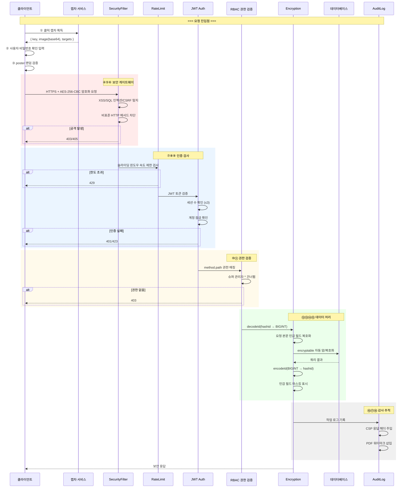

# 보안 아키텍처 다이어그램 (Security Architecture Diagram)

> Copyright (c) 2026 erik <erik@erik.xyz> — https://erik.xyz

---

## 1. 18단계 심층 방어 전체

---

## 2. 요청 보안 처리 체인

---

## 3. 데이터 암호화 전체 체인

---

## 4. 인증과 권한 부여 모델

---

## 5. 공격면 보호 매트릭스

---

## 6. 감사 추적 체계

