# Sistema de Gestão de Propriedades (Property Management Platform)

[Português](../pt/README.md) | [中文](../../../README.md)

> Copyright (c) 2026 erik <erik@erik.xyz> — https://erik.xyz

Sistema full-stack de gestão de propriedades, cobrindo 22 módulos de negócio + 12 funcionalidades estendidas (notificações/fluxo de aprovação/pagamento/votação/SLA/painel de dados/cobrança de inadimplência/inspeção/loja/reconhecimento facial/grupo/P&R inteligente). O painel de administração (admin) e o portal de proprietários (service) são implantados separadamente; o front-end cobre Flutter Web (estilo de painel de administração para PC) e o app móvel HarmonyOS.

## Estrutura do projeto

```
property-management-platform/
├── admin/                         # Projeto webman v2 do painel de administração
│   ├── app/
│   │   ├── admin/controller/      # Controladores do painel de administração
│   │   ├── api/v1/controller/     # Controladores da API pública
│   │   ├── common/                # Classes utilitárias comuns
│   │   ├── middleware/            # Middlewares (autenticação/autorização/limite de taxa/segurança)
│   │   ├── model/                 # Modelos de dados (Eloquent ORM)
│   │   ├── queue/                 # Tarefas de fila
│   │   └── process/               # Gerenciamento de processos
│   ├── apps/
│   │   ├── flutter/               # Flutter Web do painel de administração (estilo PC)
│   │   └── harmonyos/             # App HarmonyOS do painel de administração
│   ├── config/                    # Arquivos de configuração (com comentários em chinês)
│   ├── database/
│   │   └── backup/                # Scripts de backup do banco de dados
│   ├── resource/
│   │   └── translations/          # Arquivos de idioma (zh_CN / en)
│   ├── docs/                      # Documentação do painel de administração
│   ├── tests/                     # Testes unitários
│   └── public/                    # Entrada Web
├── service/                       # Projeto webman v2 do portal de proprietários
│   ├── app/
│   │   ├── api/v1/controller/     # Controladores da API do portal de proprietários
│   │   ├── common/                # Classes utilitárias comuns
│   │   ├── middleware/            # Middlewares
│   │   ├── model/                 # Modelos de dados
│   │   └── process/               # Gerenciamento de processos
│   ├── config/                    # Arquivos de configuração
│   ├── resource/
│   │   └── translations/          # Arquivos de idioma
├── apps/
│   ├── flutter/                   # Flutter Web do portal de proprietários (estilo PC)
│   └── harmonyos/                 # App HarmonyOS do portal de proprietários
└── docs/                          # Documentação do projeto
    ├── ARCHITECTURE.md
    ├── ARCHITECTURE_DESIGN.md
    ├── ARCHITECTURE_DIAGRAM.md    # Diagrama de arquitetura do sistema
    ├── FLOWCHART.md               # Fluxogramas de negócio
    ├── FUNCTION_DIAGRAM.md        # Diagrama de módulos funcionais
    ├── LIFECYCLE_DIAGRAM.md       # Diagramas de ciclo de vida
    ├── SECURITY_ARCHITECTURE.md   # Diagrama de arquitetura de segurança
    ├── API.md
    ├── FEATURES.md
    └── FEATURE_DESIGN.md
```

## Tamanho do projeto

| Camada | Quantidade | Detalhes |
|----|------|------|
| Tabelas do banco | 65 | Todas com prefixo `management_`, chave primária BIGINT sem autoincremento |
| Modelos PHP | admin 64 / service 57 | Todos modelos Eloquent, com campos criptografados via encryptable; os 57 do service são arquivos de modelo (incluindo a classe base BaseModel) |
| Controladores admin | 58 | Gestão geral + 22 módulos de propriedades + 12 funcionalidades estendidas |
| Controladores service | 17 | Todas as APIs do portal de proprietários |
| Rotas de API | 178 | admin 125 + service 53 |
| Flutter painel de administração | 42 páginas | 42 módulos de página, 96 arquivos/6.662 linhas |
| Flutter portal de proprietários | 13 páginas | cobranças/reparos/estacionamento/visitantes/atividades/notificações/votação/loja/P&R inteligente/reconhecimento facial, 32 arquivos/3.582 linhas |
| HarmonyOS | 7 páginas | login/início/faturas/reparos(2)/anúncios/central pessoal, 11 arquivos/927 linhas |
| Testes | 133 | admin 90 (217 asserções) + service 43 (248 asserções) |

## Arquitetura do sistema e diagramas de design

> Os diagramas abaixo são visões gerais; diagramas detalhados em [Diagrama de arquitetura](docs/ARCHITECTURE_DIAGRAM.md) · [Fluxogramas](docs/FLOWCHART.md) · [Diagrama funcional](docs/FUNCTION_DIAGRAM.md) · [Diagrama de ciclo de vida](docs/LIFECYCLE_DIAGRAM.md) · [Diagrama de arquitetura de segurança](docs/SECURITY_ARCHITECTURE.md)

### Arquitetura geral do sistema



### Fluxo de negócio principal



### Visão geral dos módulos funcionais



### Ciclo de vida das entidades de dados



### Defesa em profundidade com 18 camadas de segurança



## Módulos funcionais (22 módulos + 12 extensões)

| Fase | Módulos | Status |
|------|------|------|
| 1ª fase | condomínio, edifício, unidade, layout, propriedade, proprietário, inquilino, cobranças, reparos, anúncios (10 módulos) | ✅ Concluídos |
| 2ª fase | estacionamento, equipamentos, reclamações, visitantes, contratos, financeiro (6 módulos) + visualização em painel + exportação Excel/PDF (recursos da plataforma) | ✅ Concluídos |
| 3ª fase | patrulha de segurança, limpeza, paisagismo, atividades comunitárias, consumo de energia, funcionários (6 módulos) | ✅ Concluídos |
| Extensões | notificações, fluxo de aprovação, integração de pagamento, votação de proprietários, escalonamento automático de SLA, painel de dados, cobrança de inadimplência inteligente, app móvel de inspeção, loja comunitária, reconhecimento facial, gestão de grupo multi-condomínio, P&R inteligente (12 módulos) | ✅ Concluídos |

## Pilha de tecnologias

### Back-end
- **Framework**: webman v2 (workerman/webman)
- **Linguagem**: PHP 8.3+
- **Banco de dados**: MySQL 8.0+, prefixo de tabelas `management_`, chave primária BIGINT sem autoincremento
- **Mecanismo de busca**: Elasticsearch 8.x
- **Cache**: Redis 7.x

### Dependências principais
| Pacote | Uso |
|------|------|
| `erikwang2013/snowflake-php` | Geração de chave primária BIGINT única global |
| `erikwang2013/hashids` | Criptografia/descriptografia de ID na camada de API |
| `erikwang2013/jwt-webman` | Autenticação JWT (HS256) |
| `erikwang2013/encryption` | Criptografia AES-256-CBC de dados sensíveis na transmissão via API |
| `erikwang2013/encryptable` | Criptografia/descriptografia de campos sensíveis no banco |
| `erikwang2013/webman-scout` | Sincronização de dados e busca em texto completo com Elasticsearch |
| `erikwang2013/season` | Dados de bandeiras de países |
| `erikwang2013/security-php` | Detecção de ferramentas de segurança |
| `erikwang2013/poster-php` | Código de verificação aleatório para operações sensíveis |
| `phpoffice/phpspreadsheet` | Exportação em Excel |
| `barryvdh/laravel-dompdf` | Exportação em PDF |
| `hg/apidoc` | Geração automática da documentação da API |

### Front-end
- **Flutter 3.x** + GetX (com i18n) + Dio + fl_chart — painel de administração Web em estilo PC
- **HarmonyOS ArkTS** + @ohos.net.http — app móvel

### Documentação da API

Todos os endpoints e parâmetros da API estão no documento [docs/API.md](docs/API.md). Após iniciar o serviço, também é possível acessar a documentação interativa gerada automaticamente pelo apidoc:

| Endpoint | Endereço | Grupos |
|----|------|------|
| Painel de administração | `http://localhost:8787/apidoc` | 10 grupos (common/dashboard/system/property-core/property-aux/property-adv/extensions/export/import/upload) |
| Portal de proprietários | `http://localhost:8788/apidoc` | 9 grupos (API pública/início/cobranças/reparos/feedback/estacionamento/atividades/pessoal/extensões) |

### Internacionalização

- **Back-end PHP**: symfony/translation, arquivos de idioma em `resource/translations/{zh_CN,en}/messages.php`
- **Flutter Web**: `Translations` do GetX, `apps/flutter/lib/i18n/messages.dart`
- **Idioma padrão**: chinês simplificado (zh_CN), com suporte a alternância para inglês (en)
- **Cabeçalho de requisição**: o idioma da resposta pode ser controlado pelo cabeçalho `Accept-Language`

## Sistema de segurança (defesa em profundidade com 18 camadas)

1. Código de verificação por clique → 2. Confirmação dupla de senha → 3. Verificação aleatória poster → 4. Varredura de segurança security-php → 5. Bloqueio de ataques SecurityFilter → 6. Criptografia em trânsito HTTPS + AES-256-CBC → 7. Autenticação JWT HS256 → 8. Limite de sessões simultâneas (máx. 3) → 9. Bloqueio de conta (5 falhas/15 minutos) → 10. Autorização de permissões RBAC (granularidade method.path) → 11. Limite de taxa por janela deslizante no Redis → 12. Proteção de ID com Hashids → 13. Criptografia de campos sensíveis no corpo da requisição → 14. Armazenamento criptografado de campos do banco → 15. Mascaramento de dados na camada de exibição → 16. Auditoria completa de logs de operações (8 plataformas de origem) → 17. Proteção por cabeçalho CSP → 18. Marca d'água de direitos autorais em PDF

## Padrões de código

- Todos os novos arquivos incluem a declaração de direitos autorais no topo: `Copyright (c) 2026 erik <erik@erik.xyz> — https://erik.xyz`
- Funções/classes globais são referenciadas com `use`, sem `\` inicial
- Os arquivos de configuração incluem comentários em chinês explicando cada item
- A chave primária ID usa BIGINT UNSIGNED NOT NULL, gerada pela camada de aplicação com snowflake-php
- Os IDs transmitidos pela API usam criptografia/descriptografia hashids

## Início rápido

### Opção 1: Assistente de instalação Web (recomendado)

Após iniciar o painel de administração, acesse `http://localhost:8787/install` e conclua a configuração do banco de dados e a criação da conta de administrador pela interface.

```bash
cd admin
cp .env.example .env
composer install
php start.php start -d
# Acesse http://localhost:8787/install para concluir a instalação
```

Consulte o [Guia de instalação](docs/INSTALL.md).

### Opção 2: Instalação manual

#### Requisitos de ambiente

- PHP 8.1+
- MySQL 8.0+
- Redis 6.0+
- Composer 2.x
- Flutter SDK 3.x (desenvolvimento de front-end)

#### 1. Inicializar o banco de dados

```bash
mysql -u root -e "CREATE DATABASE IF NOT EXISTS management DEFAULT CHARSET utf8mb4 COLLATE utf8mb4_unicode_ci;"
mysql -u root management < docs/install.sql
```

#### 2. Iniciar o painel de administração

```bash
cd admin
cp .env.example .env
# Edite o .env para alterar a senha do banco de dados etc.
composer install
php start.php start -d
# O painel de administração roda em http://localhost:8787
```

### 3. Iniciar o portal de proprietários

```bash
cd service
cp .env.example .env
# Edite o .env para alterar a senha do banco de dados etc.
composer install
php start.php start -d
# O portal de proprietários roda em http://localhost:8788
```

### 4. Iniciar o front-end (desenvolvimento)

```bash
cd apps/flutter
flutter pub get
flutter run -d chrome
```

### 5. Executar os testes

```bash
# Testes do painel de administração
cd admin && php vendor/bin/phpunit

# Testes do portal de proprietários
cd service && php vendor/bin/phpunit
```

| Projeto | Testes | Asserções | Taxa de aprovação |
|------|--------|--------|--------|
| admin | 90 | 217 | 100% |
| service | 43 | 248 | 100% (1 ignorado) |
| **Total** | **133** | **465** | — |

Cobertura dos testes do service: ID Snowflake, codificação/decodificação Hashids, formato de resposta, schema do banco, arquivos de tradução i18n

### Implantação com Docker

```bash
cd admin
cp .env.docker .env
docker-compose up -d
# Inclui Nginx + PHP + MySQL + Redis + Elasticsearch
```

## Topologia de implantação

```
Nginx (:443) → admin webman (:8787) + service webman (:8788) → MySQL + Redis + Elasticsearch
Arquivos estáticos: Flutter Web build/
```

## Administrador padrão

| Usuário | Senha | Papel |
|--------|------|------|
| admin | admin123 | Superadministrador |

> Em produção, altere a senha padrão imediatamente.

## Índice de documentação

| Documento | Descrição |
|------|------|
| [Guia de instalação](docs/INSTALL.md) | Guia de implantação do zero, incluindo inicialização do banco, implantação Docker e perguntas frequentes |
| [Script de instalação consolidado](docs/install.sql) | Todas as 65 tabelas + dados de seed de permissões RBAC, importação em um clique |
| [Comparação de edições](docs/EDITIONS.md) | Comparação de funcionalidades e métricas técnicas entre Lite / Standard / Full |
| [Documento de design de arquitetura](docs/ARCHITECTURE_DESIGN.md) | Arquitetura em camadas do sistema, cadeia de execução de middlewares, design de defesa em profundidade |
| [Documento de arquitetura](docs/ARCHITECTURE.md) | Diagramas Mermaid da arquitetura (topologia do sistema, ciclo de vida da requisição, criptografia de dados, implantação) |
| [Diagrama de arquitetura do sistema](docs/ARCHITECTURE_DIAGRAM.md) | Arquitetura geral, diagramas detalhados por camada, arquitetura de implantação (visualização Mermaid) |
| [Fluxogramas de negócio](docs/FLOWCHART.md) | Fluxo de autenticação, gestão de cobranças, processamento de reparos, gestão de propriedades, reclamações, visitantes |
| [Diagrama de módulos funcionais](docs/FUNCTION_DIAGRAM.md) | Panorama dos 34 módulos, dependências, árvore de funções do painel de administração, mapa de funções do portal de proprietários |
| [Diagramas de ciclo de vida](docs/LIFECYCLE_DIAGRAM.md) | Ciclo de vida da requisição, ciclo de vida de entidades, ciclo de vida do Token, fluxo completo de CRUD |
| [Diagrama de arquitetura de segurança](docs/SECURITY_ARCHITECTURE.md) | Panorama da defesa em profundidade com 18 camadas, matriz de proteção de superfícies de ataque, cadeia completa de criptografia, sistema de rastreabilidade de auditoria |
| [Documento de design de funcionalidades](docs/FEATURE_DESIGN.md) | Especificações funcionais dos 34 módulos |
| [Documento de funcionalidades](docs/FEATURES.md) | Lista de funcionalidades e visão geral dos módulos |
| [Documentação da API](docs/API.md) | Todos os endpoints da API e descrição de parâmetros |

## Apoie o projeto

Agradecemos o seu apoio!

|  |  |
|:---:|:---:|
| WeChat Pay | Alipay |

### Doações por transferência internacional

Transferências bancárias de qualquer lugar do mundo são aceitas, conta beneficiária no ZA Bank (Hong Kong):

| Item | Informação |
|------|------|
| Nome do beneficiário | WANG KEXUN |
| Número da conta | 881015918251 |
| Banco beneficiário | ZA Bank Limited |
| SWIFT Code | AABLHKHHXXX |
| Código do banco | 387 |
| Endereço do banco | Core F, Cyberport 3, 100 Cyberport Road, Hong Kong |

> **Banco correspondente (intermediário) para remessas internacionais**: as informações abaixo são do banco correspondente (intermediário), não do banco beneficiário. Consulte o banco remetente se as informações do banco intermediário forem necessárias.
>
> - **Para remessas em HKD, CNY e USD** (Citibank N.A. Hong Kong): SWIFT `CITIHKXXXX`, código do banco 006, código da agência 391, endereço: Citibank Tower, Citibank Plaza, 3 Garden Road, Central, Hong Kong
> - **Para outras moedas** (THE BANK OF NEW YORK MELLON): SWIFT `IRVTUS3NXXX`, endereço: 240 GREENWICH STREET, NEW YORK, United States

Apoie este projeto!

## License

MIT License. Consulte [LICENSE](../../../LICENSE) para detalhes.
