# Diagrama de Arquitetura do Sistema (System Architecture Diagram)

> Copyright (c) 2026 erik <erik@erik.xyz> — https://erik.xyz

---

## 1. Arquitetura geral do sistema

---

## 2. Diagrama detalhado da arquitetura em camadas

---

## 3. Arquitetura de implantação

