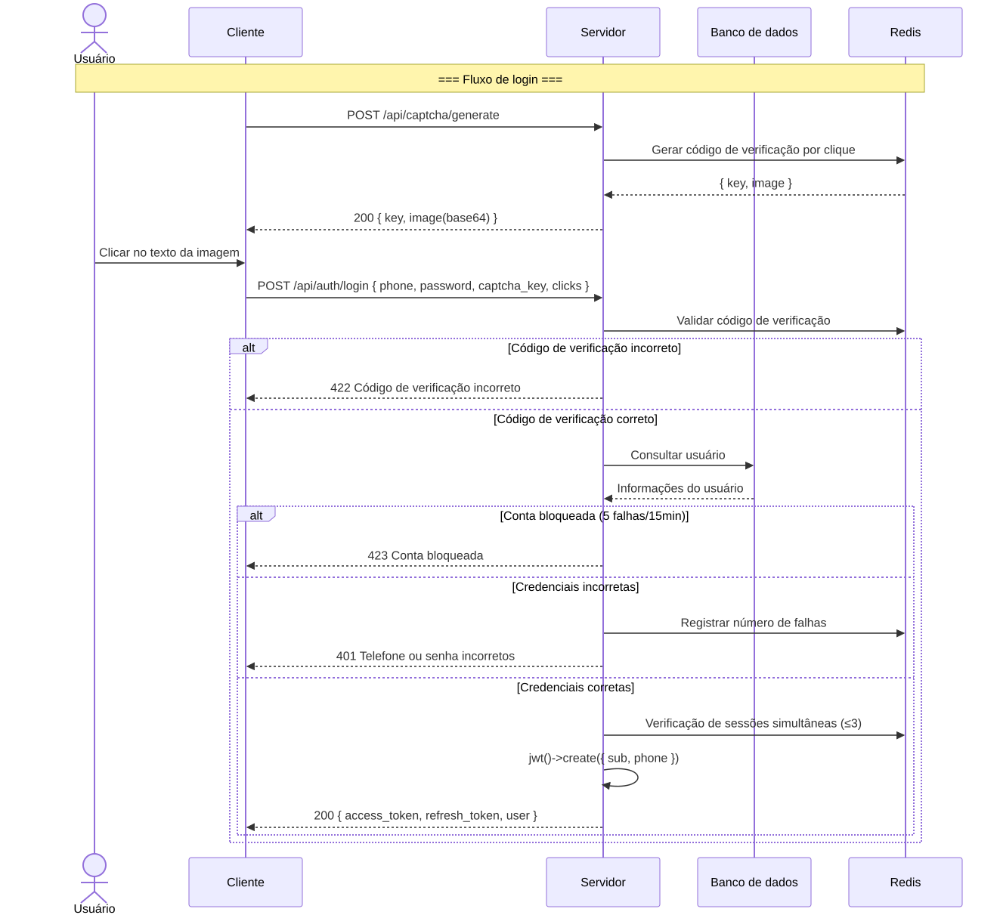
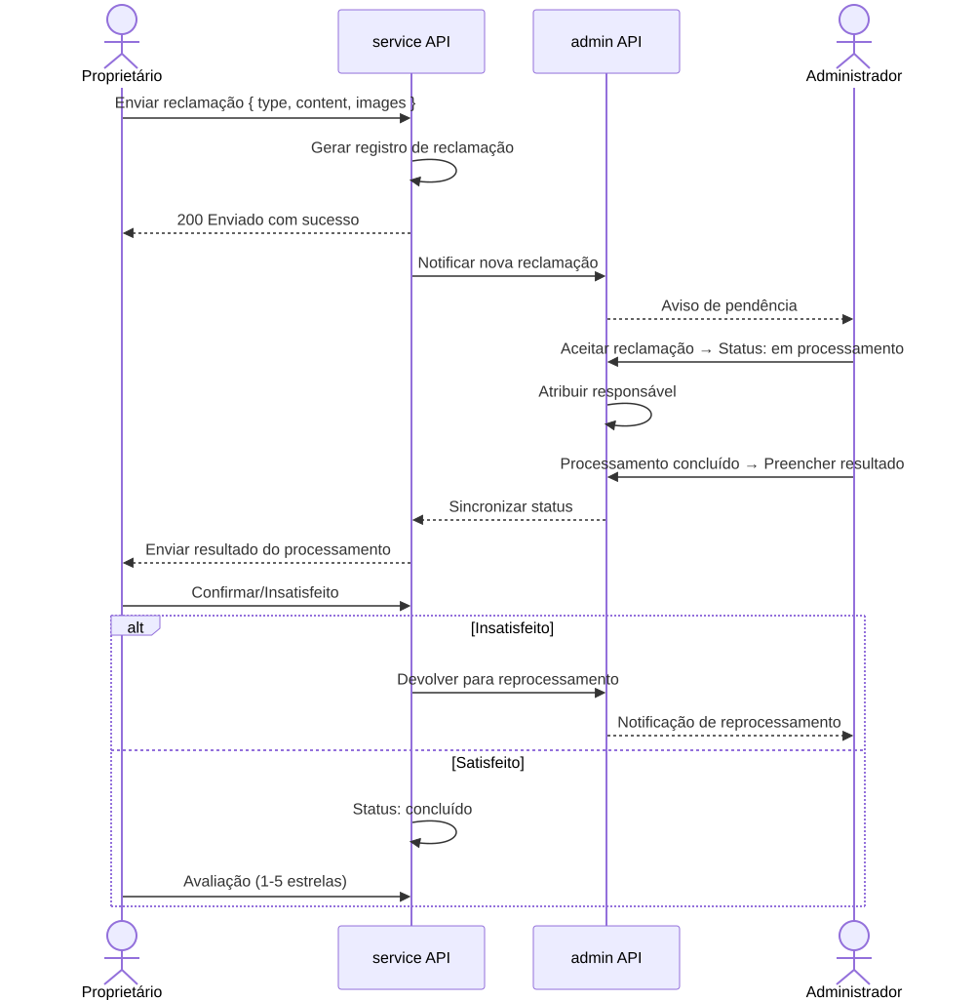

# Fluxogramas de Negócio (Business Flowchart)

> Copyright (c) 2026 erik <erik@erik.xyz> — https://erik.xyz

---

## 1. Fluxo de autenticação de usuário

---

## 2. Fluxo de negócio principal — gestão de cobranças

---

## 3. Fluxo de processamento de reparos

---

## 4. Fluxo de gestão de propriedades

---

## 5. Fluxo de processamento de reclamações e sugestões

---

## 6. Fluxo de acesso de visitantes

