# Diagrama de Módulos Funcionais (Function Module Diagram)

> Copyright (c) 2026 erik <erik@erik.xyz> — https://erik.xyz

> English edition: `../../../images/design_function_en.svg`

---

## 1. Panorama dos módulos funcionais

---

## 2. Relações de dependência entre módulos

---

## 3. Árvore de funções do painel de administração

---

## 4. Mapa de funções do portal de proprietários

