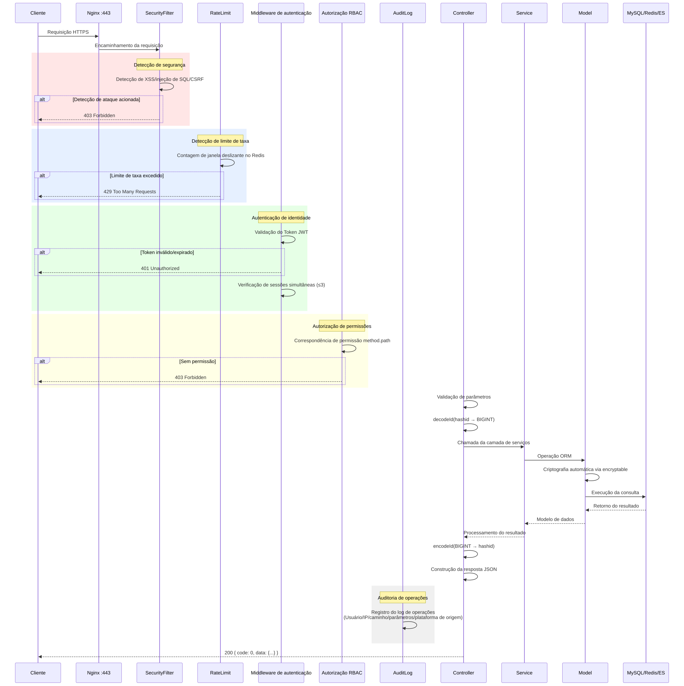
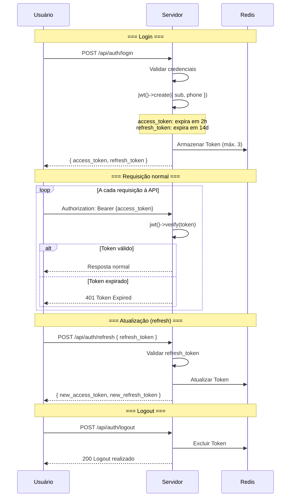

# Diagramas de Ciclo de Vida (Lifecycle Diagram)

> Copyright (c) 2026 erik <erik@erik.xyz> — https://erik.xyz

> English edition: `../../../images/design_lifecycle_en.svg`

---

## 1. Ciclo de vida da requisição

---

## 2. Ciclo de vida da entidade de dados — Proprietário (Owner)

---

## 3. Ciclo de vida da entidade de dados — Fatura de cobrança (Fee Bill)

---

## 4. Ciclo de vida da entidade de dados — Ordem de reparo (Repair Order)

---

## 5. Ciclo de vida do Token JWT

---

## 6. Ciclo de vida completo dos registros do banco de dados

