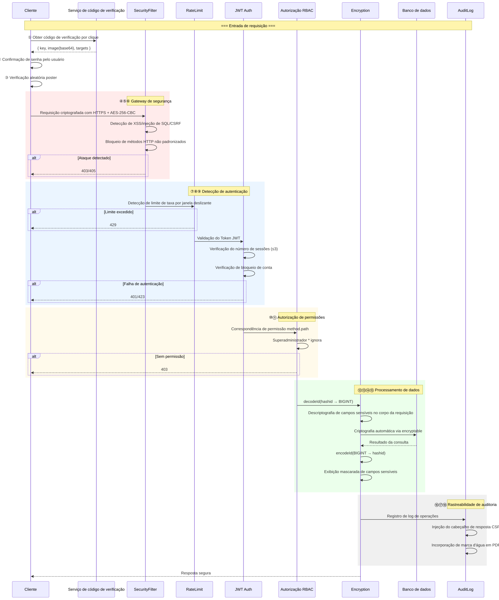

# Diagrama de Arquitetura de Segurança (Security Architecture Diagram)

> Copyright (c) 2026 erik <erik@erik.xyz> — https://erik.xyz

---

## 1. Panorama da defesa em profundidade com 18 camadas

---

## 2. Cadeia de processamento de segurança da requisição

---

## 3. Cadeia completa de criptografia de dados

---

## 4. Modelo de autenticação e autorização

---

## 5. Matriz de proteção de superfícies de ataque

---

## 6. Sistema de rastreabilidade de auditoria

