# Система управления недвижимостью (Property Management Platform)

[Русский](../ru/README.md) | [中文](../../../README.md)

> Copyright (c) 2026 erik <erik@erik.xyz> — https://erik.xyz

Полностековая система управления недвижимостью, охватывающая 22 бизнес-модуля + 12 расширенных функций (сообщения/рабочие процессы согласования/платежи/голосования/SLA/большой экран данных/взыскание/патрулирование/магазин/распознавание лиц/управление группой комплексов/интеллектуальные ответы). Админ-панель (admin) и портал жильцов (service) развёртываются раздельно, фронтенд охватывает Flutter Web (в стиле PC-админки) и мобильные приложения HarmonyOS.

## Структура проекта

```
property-management-platform/
├── admin/                         # проект webman v2 админ-панели
│   ├── app/
│   │   ├── admin/controller/      # контроллеры админ-панели
│   │   ├── api/v1/controller/     # контроллеры публичного API
│   │   ├── common/                # общие утилиты
│   │   ├── middleware/            # middleware (аутентификация/права/ограничение/безопасность)
│   │   ├── model/                 # модели данных (Eloquent ORM)
│   │   ├── queue/                 # задачи очередей
│   │   └── process/               # управление процессами
│   ├── apps/
│   │   ├── flutter/               # админ-панель Flutter Web (стиль PC)
│   │   └── harmonyos/             # админ-панель HarmonyOS App
│   ├── config/                    # файлы конфигурации (с комментариями на китайском)
│   ├── database/
│   │   └── backup/                # скрипты резервирования БД
│   ├── resource/
│   │   └── translations/          # языковые файлы интернационализации (zh_CN / en)
│   ├── docs/                      # документация админ-панели
│   ├── tests/                     # модульные тесты
│   └── public/                    # Web-вход
├── service/                       # проект webman v2 портала жильцов
│   ├── app/
│   │   ├── api/v1/controller/     # контроллеры API владельцев
│   │   ├── common/                # общие утилиты
│   │   ├── middleware/            # middleware
│   │   ├── model/                 # модели данных
│   │   └── process/               # управление процессами
│   ├── config/                    # файлы конфигурации
│   ├── resource/
│   │   └── translations/          # языковые файлы интернационализации
├── apps/
│   ├── flutter/                   # портал жильцов Flutter Web (стиль PC)
│   └── harmonyos/                 # портал жильцов HarmonyOS App
└── docs/                          # документация проекта
    ├── ARCHITECTURE.md
    ├── ARCHITECTURE_DESIGN.md
    ├── ARCHITECTURE_DIAGRAM.md    # диаграмма архитектуры системы
    ├── FLOWCHART.md               # блок-схемы бизнес-процессов
    ├── FUNCTION_DIAGRAM.md        # диаграмма функциональных модулей
    ├── LIFECYCLE_DIAGRAM.md       # диаграмма жизненного цикла
    ├── SECURITY_ARCHITECTURE.md   # диаграмма архитектуры безопасности
    ├── API.md
    ├── FEATURES.md
    └── FEATURE_DESIGN.md
```

## Масштаб проекта

| Слой | Кол-во | Детали |
|----|------|------|
| Таблицы БД | 65 | все с префиксом `erik_`, BIGINT неавтоинкрементный первичный ключ |
| Модели PHP | admin 64 / service 57 | все модели Eloquent, включая шифруемые поля encryptable; 57 в service — число файлов моделей (включая базовый класс BaseModel) |
| Контроллеры admin | 58 | общее управление + 22 модуля недвижимости + 12 расширенных функций |
| Контроллеры service | 17 | все API портала жильцов |
| Маршруты API | 178 | admin 125 + service 53 |
| Flutter админ-панель | 42 страницы | 42 модуля страниц admin, 96 файлов/6 662 строки |
| Flutter портал жильцов | 13 страниц | платежи/заявки на ремонт/парковка/посетители/мероприятия/уведомления/голосования/магазин/интеллектуальные ответы/лица, 32 файла/3 582 строки |
| HarmonyOS | 7 страниц | вход/главная/счета/заявки на ремонт(2)/объявления/личный кабинет, 11 файлов/927 строк |
| Тесты | 133 | admin 90 (217 утверждений) + service 43 (248 утверждений) |

## Архитектура системы и схемы проектирования

> Ниже — обзорные схемы, подробные диаграммы см. в [диаграмме архитектуры](docs/ARCHITECTURE_DIAGRAM.md) · [блок-схемах](docs/FLOWCHART.md) · [диаграмме функций](docs/FUNCTION_DIAGRAM.md) · [диаграмме жизненного цикла](docs/LIFECYCLE_DIAGRAM.md) · [диаграмме архитектуры безопасности](docs/SECURITY_ARCHITECTURE.md)

### Общая архитектура системы


### Ключевые бизнес-процессы


### Обзор функциональных модулей


### Жизненный цикл сущностей данных


### 18 уровней эшелонированной защиты



## Функциональные модули (22 крупных модуля + 12 расширений)

| Партия | Модули | Статус |
|------|------|------|
| Партия 1 | комплекс, корпус, квартира, планировка, объект недвижимости, владелец, арендатор, платежи, заявки на ремонт, объявления (10 модулей) | ✅ полностью готово |
| Партия 2 | парковка, оборудование, жалобы, посетители, договоры, финансы (6 модулей) + визуализация панелей + экспорт Excel/PDF (функции платформы) | ✅ полностью готово |
| Партия 3 | охрана и патрулирование, уборка, озеленение, мероприятия сообщества, энергопотребление, персонал (6 модулей) | ✅ полностью готово |
| Расширения | сообщения, рабочие процессы согласования, интеграция платежей, голосования владельцев, автоматическая эскалация SLA, большой экран данных, интеллектуальное взыскание, мобильное патрулирование, комьюнити-магазин, распознавание лиц, управление группой комплексов, интеллектуальные ответы (12 модулей) | ✅ полностью готово |

## Технологический стек

### Бэкенд
- **Фреймворк**: webman v2 (workerman/webman)
- **Язык**: PHP 8.3+
- **БД**: MySQL 8.0+, префикс таблиц `erik_`, первичный ключ BIGINT неавтоинкрементный
- **Поисковая система**: Elasticsearch 8.x
- **Кэш**: Redis 7.x

### Ключевые зависимости
| Пакет | Назначение |
|------|------|
| `erikwang2013/snowflake-php` | генерация глобально уникальных BIGINT-ключей |
| `erikwang2013/hashids` | шифрование/дешифрование ID на уровне API |
| `erikwang2013/jwt-webman` | аутентификация JWT (HS256) |
| `erikwang2013/encryption` | шифрование AES-256-CBC чувствительных данных при передаче API |
| `erikwang2013/encryptable` | шифрование/дешифрование чувствительных полей БД |
| `erikwang2013/webman-scout` | синхронизация данных Elasticsearch и полнотекстовый поиск |
| `erikwang2013/season` | данные флагов стран |
| `erikwang2013/security-php` | детектирование средствами безопасности |
| `erikwang2013/poster-php` | случайная капча для чувствительных операций |
| `phpoffice/phpspreadsheet` | экспорт Excel |
| `barryvdh/laravel-dompdf` | экспорт PDF |
| `hg/apidoc` | автоматическая генерация документации API |

### Фронтенд
- **Flutter 3.x** + GetX (включая i18n) + Dio + fl_chart — Web-админка в стиле PC
- **HarmonyOS ArkTS** + @ohos.net.http — мобильное приложение

### Документация API

Все эндпоинты и описание параметров — в отдельном документе [docs/API.md](docs/API.md). После запуска сервиса также доступна интерактивная документация apidoc:

| Сторона | Адрес | Группы |
|----|------|------|
| Админ-панель | `http://localhost:8787/apidoc` | 10 групп (common/dashboard/system/property-core/property-aux/property-adv/extensions/export/import/upload) |
| Портал жильцов | `http://localhost:8788/apidoc` | 9 групп (публичные/главная/платежи/заявки на ремонт/обратная связь/парковка/мероприятия/личное/расширения) |

### Интернационализация

- **PHP-бэкенд**: symfony/translation, языковые файлы в `resource/translations/{zh_CN,en}/messages.php`
- **Flutter Web**: GetX `Translations`, `apps/flutter/lib/i18n/messages.dart`
- **Язык по умолчанию**: упрощённый китайский (zh_CN), поддерживается переключение на английский (en)
- **Заголовок запроса**: поддерживается управление языком ответа через заголовок `Accept-Language`

## Система безопасности (18 уровней эшелонированной защиты)

1. кликовая капча → 2. повторное подтверждение пароля → 3. случайная проверка poster → 4. сканирование безопасности security-php → 5. блокировка атак SecurityFilter → 6. HTTPS + шифрование передачи AES-256-CBC → 7. аутентификация JWT HS256 → 8. ограничение параллельных сессий (макс. 3) → 9. блокировка аккаунта (5 неудач/15 минут) → 10. авторизация прав RBAC (точность method.path) → 11. ограничение частоты скользящим окном Redis → 12. защита ID Hashids → 13. шифрование чувствительных полей тела запроса → 14. шифрование полей БД → 15. маскирование данных на уровне отображения → 16. полный аудит журналов операций (8 источников платформ) → 17. защита заголовка CSP → 18. водяной знак копирайта PDF

## Стандарты кода

- Все новые файлы начинаются с заявления об авторских правах: `Copyright (c) 2026 erik <erik@erik.xyz> — https://erik.xyz`
- Глобальные функции/классы подключаются через `use`, без префикса `\`
- Файлы конфигурации содержат комментарии на китайском с описанием каждого параметра
- Первичный ключ ID — BIGINT UNSIGNED NOT NULL, генерируется на уровне приложения через snowflake-php
- ID при передаче API шифруются/расшифровываются через hashids

## Быстрый старт

### Способ 1: Web-мастер установки (рекомендуется)

После запуска админ-панели перейти на `http://localhost:8787/install` и через интерфейс выполнить настройку БД и создание учётной записи администратора.

```bash
cd admin
cp .env.example .env
composer install
php start.php start -d
# Перейти на http://localhost:8787/install для завершения установки
```

Подробнее см. [руководство по установке](docs/INSTALL.md).

### Способ 2: Ручная установка

#### Требования к окружению

- PHP 8.1+
- MySQL 8.0+
- Redis 6.0+
- Composer 2.x
- Flutter SDK 3.x (разработка фронтенда)

#### 1. Инициализация базы данных

```bash
mysql -u root -e "CREATE DATABASE IF NOT EXISTS property_management DEFAULT CHARSET utf8mb4 COLLATE utf8mb4_unicode_ci;"
mysql -u root property_management < docs/install.sql
```

#### 2. Запуск админ-панели

```bash
cd admin
cp .env.example .env
# Отредактировать .env: изменить пароль БД и другие параметры
composer install
php start.php start -d
# Админ-панель работает на http://localhost:8787
```

### 3. Запуск портала жильцов

```bash
cd service
cp .env.example .env
# Отредактировать .env: изменить пароль БД и другие параметры
composer install
php start.php start -d
# Портал жильцов работает на http://localhost:8788
```

### 4. Запуск фронтенда (разработка)

```bash
cd apps/flutter
flutter pub get
flutter run -d chrome
```

### 5. Запуск тестов

```bash
# Тесты админ-панели
cd admin && php vendor/bin/phpunit

# Тесты портала жильцов
cd service && php vendor/bin/phpunit
```

| Проект | Тестов | Утверждений | Прохождение |
|------|--------|--------|--------|
| admin | 90 | 217 | 100% |
| service | 43 | 248 | 100% (1 пропуск) |
| **Итого** | **133** | **465** | — |

Покрытие тестами service: Snowflake ID, кодирование/декодирование Hashids, формат ответа, схема БД, файлы переводов i18n

### Развёртывание Docker

```bash
cd admin
cp .env.docker .env
docker-compose up -d
# Включает Nginx + PHP + MySQL + Redis + Elasticsearch
```

## Топология развёртывания

```
Nginx (:443) → admin webman (:8787) + service webman (:8788) → MySQL + Redis + Elasticsearch
Статические файлы: Flutter Web build/
```

## Администратор по умолчанию

| Имя пользователя | Пароль | Роль |
|--------|------|------|
| admin | admin123 | супер-администратор |

> В проде немедленно смените пароль по умолчанию.

## Индекс документации

| Документ | Описание |
|------|------|
| [Руководство по установке](docs/INSTALL.md) | руководство по развёртыванию с нуля, включая инициализацию БД, Docker, частые вопросы |
| [Объединённый скрипт установки](docs/install.sql) | все 65 таблиц + начальные данные RBAC, импорт одной командой |
| [Сравнение версий](docs/EDITIONS.md) | сравнение функций и технических показателей: базовой (Lite) / стандартной (Standard) / полной (Full) |
| [Документ архитектурного проектирования](docs/ARCHITECTURE_DESIGN.md) | многослойная архитектура системы, цепочка выполнения middleware, эшелонированная защита |
| [Документ архитектуры](docs/ARCHITECTURE.md) | диаграммы Mermaid (топология системы, жизненный цикл запроса, шифрование данных, развёртывание) |
| [Диаграмма архитектуры системы](docs/ARCHITECTURE_DIAGRAM.md) | общая архитектура, детальные слои, архитектура развёртывания (визуализация Mermaid) |
| [Блок-схемы бизнес-процессов](docs/FLOWCHART.md) | процесс аутентификации, управление платежами, обработка заявок на ремонт, управление объектами, жалобы, посетители |
| [Диаграмма функциональных модулей](docs/FUNCTION_DIAGRAM.md) | обзор 34 модулей, зависимости, дерево функций админ-панели, карта функций портала жильцов |
| [Диаграмма жизненного цикла](docs/LIFECYCLE_DIAGRAM.md) | жизненный цикл запроса, жизненный цикл сущностей, жизненный цикл Token, полный процесс CRUD |
| [Диаграмма архитектуры безопасности](docs/SECURITY_ARCHITECTURE.md) | обзор 18 уровней защиты, матрица защиты поверхностей атак, полная цепочка шифрования, система аудита |
| [Документ функционального проектирования](docs/FEATURE_DESIGN.md) | спецификации функций 34 модулей |
| [Документ функций](docs/FEATURES.md) | перечень функций и обзор модулей |
| [Документация API](docs/API.md) | все эндпоинты и описание параметров |

## Поддержка проекта

Спасибо за поддержку!

|  |  |
|:---:|:---:|
| WeChat Pay | Alipay |

### Банковский перевод из любой страны

Поддерживаются банковские переводы со всего мира, счёт получателя — ZA Bank (ZhongAn) в Гонконге:

| Параметр | Информация |
|------|------|
| Получатель | WANG KEXUN |
| Номер счёта | 881015918251 |
| Банк получателя | ZA Bank Limited |
| SWIFT Code | AABLHKHHXXX |
| Код банка | 387 |
| Адрес банка | Core F, Cyberport 3, 100 Cyberport Road, Hong Kong |

> **Агентские банки для трансграничных переводов (банки-посредники)**: ниже указаны банки-посредники, а не банк-получатель. Уточните в своём банке, требуется ли указывать банк-посредник.
>
> - **Переводы в гонконгских долларах, юанях и долларах США** (Citibank N.A. Hong Kong): SWIFT `CITIHKXXXX`, код банка 006, код отделения 391, адрес: Citibank Tower, Citibank Plaza, 3 Garden Road, Central, Hong Kong
> - **Переводы в других валютах** (THE BANK OF NEW YORK MELLON): SWIFT `IRVTUS3NXXX`, адрес: 240 GREENWICH STREET, NEW YORK, United States

Поддержите этот проект!

## License

MIT License. См. [LICENSE](LICENSE) для подробностей.
