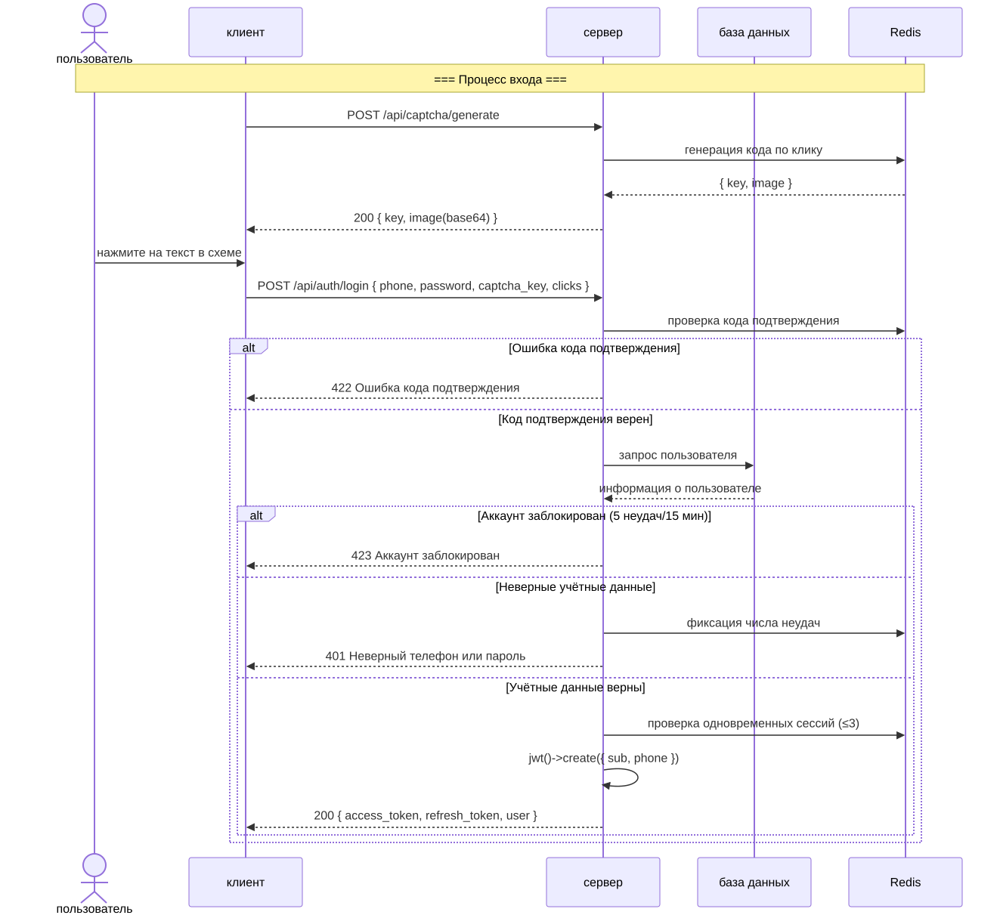
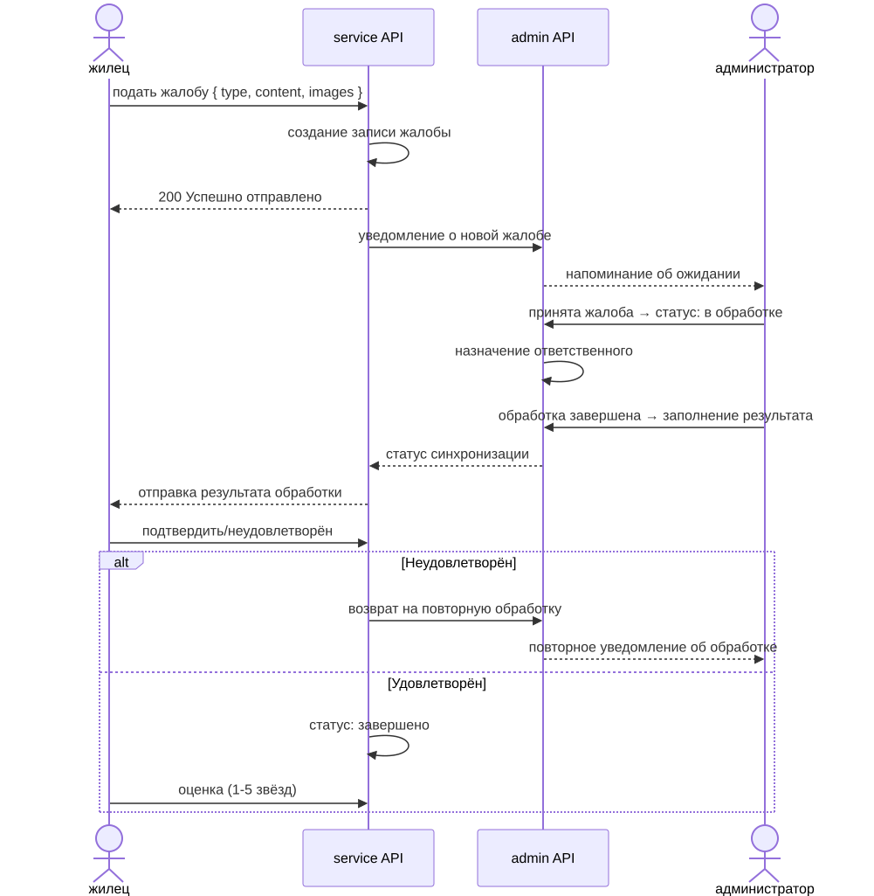

# Бизнес-процессы (Business Flowchart)

> Copyright (c) 2026 erik <erik@erik.xyz> — https://erik.xyz

---

## 1. Процесс аутентификации пользователя

---

## 2. Основной бизнес-процесс — управление платежами

---

## 3. Процесс обработки заявки на ремонт

---

## 4. Процесс управления объектами недвижимости

---

## 5. Процесс обработки жалоб и предложений

---

## 6. Процесс пропуска гостей

