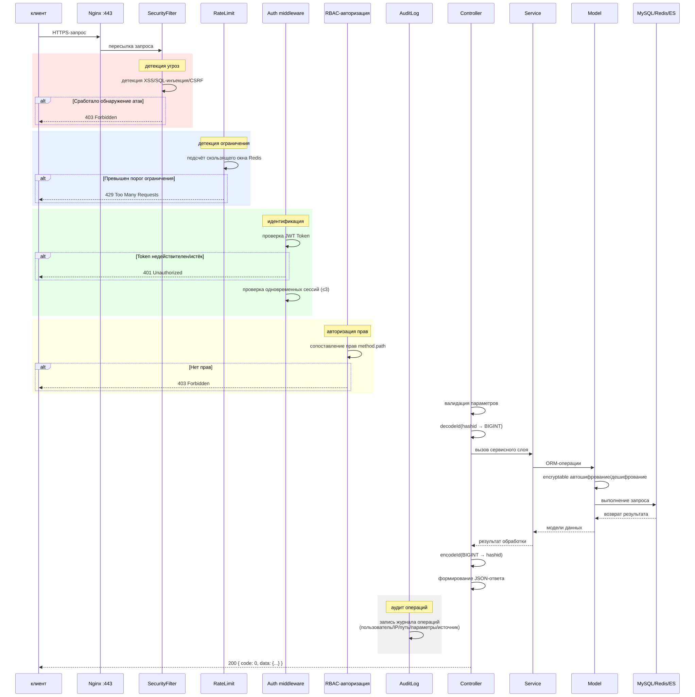
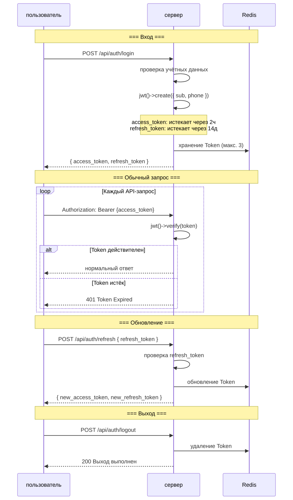

# Диаграмма жизненного цикла (Lifecycle Diagram)

> Copyright (c) 2026 erik <erik@erik.xyz> — https://erik.xyz

> English edition: `../../../images/design_lifecycle_en.svg`

---

## 1. Жизненный цикл запроса

---

## 2. Жизненный цикл сущности — жилец (Owner)

---

## 3. Жизненный цикл сущности — счёт (Fee Bill)

---

## 4. Жизненный цикл сущности — заявка на ремонт (Repair Order)

---

## 5. Жизненный цикл JWT Token

---

## 6. Полный жизненный цикл записи в базе данных

