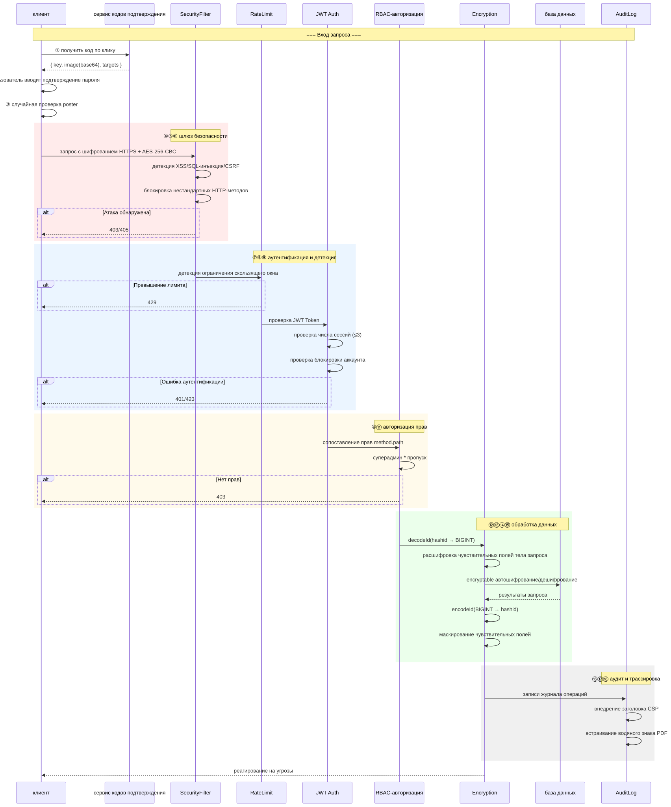

# Архитектура безопасности (Security Architecture Diagram)

> Copyright (c) 2026 erik <erik@erik.xyz> — https://erik.xyz

---

## 1. Обзор 18 уровней эшелонированной защиты

---

## 2. Цепочка безопасной обработки запроса

---

## 3. Полная цепочка шифрования данных

---

## 4. Модель аутентификации и авторизации

---

## 5. Матрица защиты поверхности атак

---

## 6. Система аудита и трассировки

